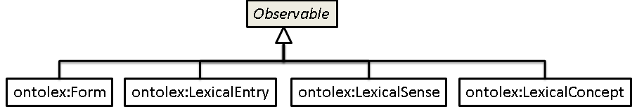

# The Ontolex Module for Frequency, Attestation and Corpus Information
# Draft Community Group Report 

Editors:
* Christian Chiarcos ([Applied Computational Linguistics, Goethe Universität Frankfurt, Germany](http://informatik.uni-frankfurt.de/)) 
* Max Ionov ([Applied Computational Linguistics, Goethe Universität Frankfurt, Germany](http://informatik.uni-frankfurt.de/)) 

Authors: (please add yourself)
* Fahad Khan ([Istituto di Linguistica Computazionale <<A. Zampolli>>, Italy](www.ilc.cnr.it/
))
*...

[Copyright](https://www.w3.org/Consortium/Legal/ipr-notice#Copyright) © 2020 the Contributors to the The Ontolex Module for Frequency, Attestation and Corpus Information Specification, published by [Ontology Lexica](http://www.w3.org/community/ontolex/) under the [W3C Community Contributor License Agreement (CLA)](https://www.w3.org/community/about/agreements/cla/). A human-readable summary is [available](https://www.w3.org/community/about/agreements/cla-deed/). 

<section id="abstract">

This document describes the _module for frequency, attestation and corpus information_ of the Lexicon Model for Ontologies (_lemon_) as a result of the work of the Ontology Lexica community group (OntoLex). The module is targeted at complementing dictionaries and other linguistic resources containing lexicographic data with a vocabulary to express

*   corpus-derived statistics (frequency and cooccurrence information, collocations),
*   pointers from lexical resources to corpora and other collections of text (attestations),
*   the annotation of corpora and other language resources with lexical information (lemmatization against a dictionary), and
*   distributional semantics (collocation vectors, word embeddings, sense embeddings, concept embeddings).

The module tackles use cases in corpus-based lexicography, corpus linguistics and natural language processing, and operates in combination with the _lemon_ core module, referred to as _OntoLex_, as well as with other _lemon_ modules.

</section>

<section id="sotd">

This document is a working draft for a module for frequency, attestation and corpus data of the OntoLex specifications. It is not a W3C Standard nor is it on the W3C Standards Track.

There are a number of ways that one may participate in the development of this report:

*   Mailing list: [public-ontolex@w3.org](http://lists.w3.org/Archives/Public/public-ontolex/)
*   Wiki: [Main page](https://www.w3.org/community/ontolex/wiki/Main_Page)
*   More information about meetings of the ONTOLEX group can be obtained [here](https://www.w3.org/community/ontolex/wiki/Main_Page#Meetings)
*   [Source code](https://github.com/ontolex/frequency-attestation-corpus-information/) for this document can be found on Github.

Disclaimer: This draft follows closely the structure and design of [The Ontolex Lexicography Module. Draft Community Group Report 28 October 2018](https://jogracia.github.io/ontolex-lexicog/), edited by Julia Bosque-Gil and Jorge Gracia. In particular, motivational and introductory text are partially adapted without being marked as quotes. This is to be replaced by original text before publication.

</section>

## Table of Contents

- [Introduction](#introduction)
	- [Background and Motivation](#background-and-motivation)
	- [Aim and Scope](#aim-and-scope)
	- [Namespaces](#namespaces)
- [Overview](#overview)
- [Definitions](#definitions)
	- [Observable](#definitions)
	- [Frequency](#frequency)
	- [Attestation](#attestation)
	- [Embeddings](#embeddings)
	- [Collocations](#collocations)
	- [Similarity](#similarity)
- [Corpus Annotation (non-normative)](#corpus-annotation-non-normative)
- [Usage guidelines](#usage-guidelines)
	- [Resource-specific subclasses of frac concepts](#resource-specific-subclasses-of-frac-concepts)
	- [RDF Serializations and CSV](#rdf-serializations-and-csv)
- [Acknowledgements](#acknowledgements)
- [References](#references)

<section>

## Introduction 

back to ([Table of Contents](#table-of-contents))

<section>

### Background and Motivation

back to ([Table of Contents](#table-of-contents))

The [_lemon_ model](https://www.w3.org/2016/05/ontolex/) provides a [core](https://www.w3.org/2016/05/ontolex/#core) vocabulary (OntoLex) to represent _linguistic information_ associated to ontology and vocabulary elements. The model follows the principle of _semantics by reference_ in the sense that the semantics of a [lexical entry](https://www.w3.org/2016/05/ontolex/#LexicalEntry) is expressed by reference to an individual, class or property defined in an ontology.

The current version of _lemon_ (as an outcome of the OntoLex group, sometimes referred as OntoLex-lemon in the literature) as well as its previous version ([lemon](https://lemon-model.net/) [<cite>[1](#bib-lemon_paper)</cite>]) have been increasingly used in the context of dictionaries and lexicographical data to convert existent lexicographic information into the standards and formats of the Semantic Web. In consequence, a designated _lemon_ <a href="">module for lexicography</a> (_lexicog_) has been designed, with applications in monolingual [<cite>[2](#bib-klimek-kdict)</cite>], bilingual [<cite>[3](#bib-gracia-apertium)</cite>], and multilingual [<cite>[4](#bib-bosque-kdict)</cite>] dictionaries, as well as diachronic [<cite>[5](#bib-kahn-diachronic)</cite>], dialectal [<cite>[6](#bib-declerck-dialectal)</cite>], and etymological ones [<cite>[7](#bib-abromeit-etymological)</cite>], among others. This module is partially motivated by requirements of corpus-based lexicography (frequency and collocation information) and digital philology (linking lexical resources with corpus data).

A second motivation for a _lemon_ model for corpus-based information comes from natural language processing. With the rise of distributional semantics since the early 1990s, lexical semantics have been complemented by corpus-based co-occurrence statistics (KEYNESS-REFERENCE???), collocation vectors (Schütze 1993), word embeddings (Collobert et al. 2012) and sense embeddings (??? and Schütze, 2017). With the proposed module, _lemon_ can serve as a community standard to encode, store and exchange vector representations (embeddings) along with the lexical concepts, senses, lemmas or words that they represent. The processing of word embeddings is beyond the scope of this module. Embeddings are thus represented as literals ("BLOB").

The added value of using linked data technologies to represent such information is an increased level of interoperability and integration between different types of lexical resources, the textual data they pertain to, as well as distributional representations of words, lexical senses and lexical concepts. Creating a _lemon_ module in the OntoLex CG is a suitable means for establishing a vocabulary on a broad consensus that takes into account all use cases identified above in an adequate fashion. The OntoLex community is the natural forum to accomplish this for several reasons:

1.  The extended use of _lemon_ to support digital lexicography,
2.  the improved application and applicabiltiy of _lemon_ in natural language processing,
3.  the coming together of the lexicography, AI and human language technology communities, resp. resources, and
4.  the possibility of reusing already available mechanisms in _lemon_, preventing researchers from "re-inventing the wheel",

</section>

<section>

### Aim and Scope

back to ([Table of Contents](#table-of-contents))

The goal of this module is to complement _lemon_ core elements with a vocabulary layer to represent lexicographical and semantic information derived from or defined with reference to corpora and external resources in a way that (a) _generalizes_ over use cases from digital lexicography, natural language processing, artificial intelligence, computational philology and corpus linguistics, that (b) facilitates _exchange, storage and re-usability_ of such data along with lexical information, and that (c) _minimizes information loss_.

The scope of the model is three-fold:

1.  extending the _OntoLex-lexicog_ model with corpus information to support existing challenges in corpus-driven lexicography,
2.  modelling _existing_ lexical and distributional-semantic resources (corpus-based dictionaries, collocation dictionaries, embeddings) as linked data, to allow their conjoint publication and inter-operation by Semantic Web standards, and
3.  providing a conceptual / abstract model of relevant concepts in _distributional semantics_ that facilitates building linked data-based applications that consume and combine both lexical and distributional information.

_Corpus_ as used throughout this document is understood in its traditional, broader sense as a structured data collection -- or material suitable for being included into such a collection, such as manuscripts or other works. We do not intend to limit the use of the term to corpora in a linguistic or NLP sense. Language resources of any kind (web documents, dictionaries, plain text, unannotated corpora, etc.) are considered "corpus data" and a collection of such information as a "corpus" in this sense. Any information drawn from or pertaining to such information is considered "corpus-based".

</section>

<section>

### Namespaces

back to ([Table of Contents](#table-of-contents))

This is a list of relevant namespaces that will be used in the rest of this document:

OntoLex module for frequency, attestation and corpus information

    @prefix frac: <http://www.w3.org/ns/lemon/frac#> .

OntoLex (core) model and other _lemon_ modules:

    @prefix ontolex: <http://www.w3.org/ns/lemon/ontolex#> .
    @prefix synsem: <http://www.w3.org/ns/lemon/synsem#> .
    @prefix decomp: <http://www.w3.org/ns/lemon/decomp#> .
    @prefix vartrans: <http://www.w3.org/ns/lemon/vartrans#> .
    @prefix lime: <http://www.w3.org/ns/lemon/lime#> .
    @prefix lexicog: <http://www.w3.org/ns/lemon/lexicog#> .

Other models [TO REVIEW]:

    @prefix rdf: <http://www.w3.org/1999/02/22-rdf-syntax-ns#>.
    @prefix owl: <http://www.w3.org/2002/07/owl#>.
    @prefix xsd: <http://www.w3.org/2001/XMLSchema#>.
    @prefix skos: <http://www.w3.org/2004/02/skos#>.
    @prefix dbr: <http://dbpedia.org/resource/>.
    @prefix dbo: <http://dbpedia.org/ontology/>.
    @prefix void: <http://rdfs.org/ns/void#>.
    @prefix lexinfo: <http://www.lexinfo.net/ontology/2.0/lexinfo#>.
    @prefix dct: <http://purl.org/dc/terms/>.
    @prefix provo: <http://www.w3.org/ns/prov#>.
    @prefix rdfs: <http://www.w3.org/2000/01/rdf-schema#>.
    @prefix oa: <http://www.w3.org/ns/oa#>.
    @prefix aat: <http://vocab.getty.edu/aat/>.

</section>

</section>

<section>

## Overview

back to ([Table of Contents](#table-of-contents))

The following diagram depicts the OntoLex module for frequency, attestation and corpus information (_frac_). Boxes represent classes of the model. Arrows with filled heads represent object properties. Arrows with empty heads represent rdfs:subClassOf. Vocabulary elements introduced by this module are shaded grey (classes) or set in _italics_.

Fig. 2 Module for Frequency, Attestation and Corpus Information (_frac_), overview

> DISCUSSION: Looks more complicated than it is. Shall we drop inferrable information ? (rdf:rest, rdf:first are available vocabulary elements because ContextualRelation is a subclass of rdf:List, subclasses of ontolex:Element should be dropped once ontolex:Element is introduced.) Keep rdf:List elements only if preserved in other ontolex modules.

</section>

<section>

## Definitions

back to ([Table of Contents](#table-of-contents))

<section>

### frac:Observable

back to ([Table of Contents](#table-of-contents))

For OntoLex, we assume that frequency, attestation and corpus information can be provided about _every_ linguistic content element in the core model and in existing or forthcoming OntoLex modules. This includes ontolex:Form (for token frequency, etc.), ontolex:LexicalEntry (frequency of disambiguated lemmas), \ontolex:LexicalSense (sense frequency), ontolex:LexicalConcept (e.g., synset frequency), lexicog:Entry (if used for representing homonyms: frequency of non-disambiguated lemmas), etc.

In particular, we consider all these elements as being countable, annotatable/attestable and suitable for a numerical representation by means of a vector (embedding). For this reason, we introduce frac:Observable as a top-level element within the FrAC module that is used to define the rdfs:domain of any properties that link lexical and corpus-derived information. 

> ----------------------- ------------------------------------
> ### Observable (Class)
> **URI:** [http://www.w3.org/nl/lemon/frac#Observable](http://www.w3.org/nl/lemon/frac#Observable)
> **Observable** is an abstract superclass for any element of a lexical resource that frequency, attestation or corpus-derived information can be expressed about. This includes, among others, `ontolex:LexicalEntry`, `ontolex:LexicalSense`, `ontolex:Form`, and `ontolex:LexicalConcept`. Elements that FrAC properties apply to  must be observable in a corpus or another linguistic data source.
> ----------------------- ------------------------------------

Fig. 1. ontolex:Element as a superclass of ontolex:LexicalEntry, ontolex:Form, ontolex:LexicalSense and ontolex:LexicalConcept

> If future OntoLex modules require a similar generalization, it is advisable to deprecate frac:Observable and to replace it with a designated top-level concept ontolex:LexicalElement _in the core model_. Note that with _LemonElement_, such a concept used to exist in [_Monnet-Lemon_](https://www.lexinfo.net/ontology/lemon.owl), but has been abandoned in the 2016 edition of _OntoLex-lemon_. 

> Note that frac:Observable is not limited to OntoLex core elements but that it can also include ontological concepts in general, as these are foreseen as external elements that OntoLex-Lemon can provide information about

</section>

<section>

### Frequency

back to ([Table of Contents](#table-of-contents))

Frequency information is a crucial component in human language technology. Corpus-based lexicography originates with Francis and Kucera (1958), and subsequently, the analysis of frequency distributions of word forms, lemmas and other linguistic elements has become a standard technique in lexicography and philology, and given rise to the field of corpus linguistics. At its core, this means that lexicographers use corpus frequency and distribution information while compiling lexical entries (also see the section on collocations and similarity below). As a qualitative assessment, frequency can be expressed with [lexinfo:frequency](http://www.lexinfo.net/ontology/2.0/lexinfo#frequency), "[t]he relative commonness with which a term occurs". However, this is an object property with possible values lexinfo:commonlyUsed, lexinfo:infrequentlyUsed, lexinfo:rarelyUsed, while absolute counts over a particular resource (corpus) require novel vocabulary elements.

For modelling, we focus on absolute frequencies, as relative frequencies can be derived if absolute frequencies and totals are known. Absolute frequencies are used in computational lexicography (e.g., the [Electronic Penn Sumerian Dictionary](http://oracc.museum.upenn.edu/epsd2/)), and they are an essential piece of information for NLP and corpus linguistics.
In order to avoid confusion with lexinfo:Frequency (which provides lexicographic assessments such as commonly used, infrequently used, etc.), this is defined with reference to a particular dataset, a corpus.

> ----------------------- ------------------------------------
> ### frequency (ObjectProperty)
> **URI:** [http://www.w3.org/nl/lemon/frac#frequency](http://www.w3.org/nl/lemon/frac#frequency)
> The property **frequency** assigns a particular `frac:Observable` a `frac:CorpusFrequency`.
> **rdfs:range** `frac:Observable`
> **rdfs:domain** `frac:CorpusFrequency`
>
> ----------------------- ------------------------------------

> ----------------------- ------------------------------------
> ### CorpusFrequency (Class)
> **URI:** [http://www.w3.org/nl/lemon/frac#CorpusFrequency](http://www.w3.org/nl/lemon/frac#CorpusFrequency)
> **Corpus frequency** provides the absolute number of attestations (`rdf:value`) of a particular `frac:Observable` (see `frac:frequency`) in a particular language resource (`frac:corpus`).
> **SubClassOf:** `rdf:value` exactly 1 `xsd:int`, `frac:corpus` min 1
>
> ----------------------- ------------------------------------

> If information from multiple language resources is aggregated (also cf. the section on embeddings below), multiple `dct:source` statements should be provided, to each resource individually. The cardinality of `dct:source` is thus 1 or higher.

> QUESTION: better alternative to `dct:source`?

The following example illustrates word and form frequencies for the Sumerian word _a_ (n.) "water" from the [Electronic Penn Sumerian Dictionary](http://oracc.museum.upenn.edu/epsd2/sux) and the frequencies of the underlying corpus.

    # word frequency, over all form variants
    epsd:a_water_n a ontolex:LexicalEntry;
     frac:frequency [ 
      a frac:CorpusFrequency;
      rdf:value "4683"^^xsd:int;
      dct:source <http://oracc.museum.upenn.edu/epsd2/pager> ] .

    # form frequency for individual orthographical variants
    epsd:a_water_n ontolex:canonicalForm [
     ontolex:writtenRep "??"@sux-Xsux, "a"@sux-Latn;
     frac:frequency [
      a frac:CorpusFrequency;
      rdf:value "4656"^^xsd:int;
      dct:source <http://oracc.museum.upenn.edu/epsd2/pager> ] ] .

    epsd:a_water_n ontolex:otherForm [
     ontolex:writtenRep "??"@sux-Xsux, "a2"@sux-Latn;
     frac:frequency [
      a frac:CorpusFrequency;
      rdf:value "1"^^xsd:int;
      dct:source <http://oracc.museum.upenn.edu/epsd2/pager> ] ] .

    epsd:a_water_n ontolex:otherForm [
     ontolex:writtenRep "??"@sux-Xsux, "e"@sux-Latn;
     frac:frequency [
      a frac:CorpusFrequency;
      rdf:value "24"^^xsd:int;
      dct:source <http://oracc.museum.upenn.edu/epsd2/pager> ] ].

The example shows orthographic variation (in the original writing system, Sumerian Cuneiform sux-Xsux, and its Latin transcription sux-Latn). It is slightly simplified insofar as the ePSD2 provides individual counts for different periods and that only three of six orthographical variants are given. Note that these are orthographical variants, not morphological variants (which are not given in the dictionary).

> It is necessary to provide the link to the underlying corpus _for every frequency assessment_ because the same element may receive different counts over different corpora. For data modelling, it is recommended to define a corpus- or collection-specific subclass of frac:CorpusFrequency with a fixed dct:source value. This leads to more compact data and avoids potential difficulties with the Open World Assumption (interpretability of incomplete data).

<pre>				 
# Corpus Frequency in the EPSD corpus
:EPSDFrequency rdfs:subClassOf frac:CorpusFrequency.
:EPSDFrequency rdfs:subClassOf
 [ a owl:Restriction ;
   owl:onProperty dct:source ;
   owl:hasValue <http://oracc.museum.upenn.edu/epsd2/pager> ] .

# frequency assessment
epsd:a_water_n frac:frequency [ 
  a :EPSDFrequency;
  rdf:value "4683"^^xsd:int ].`
	</pre>

frac:CorpusFrequency can be extended with additional filter conditions to define sub-corpora. For example, we can restrict the subcorpus to a particular time period, e.g., the Neo-Sumerian Ur III period:

<pre>				 
# EPSD frequency for the Ur-III period (aat:300019910)
:EPSDFrequency_UrIII 
 rdfs:subClassOf :EPSDFrequency;
 rdfs:subClassOf
   [ a owl:Restriction ;
     owl:onProperty dct:temporal ;
     owl:hasValue aat:300019910 ] .

# frequency assessment for sub-corpus
epsd:a_water_n frac:frequency [ 
  a :EPSDFrequency_UrIII;
  rdf:value "2299"^^xsd:int ].` </pre>

</section>
<section>

### Attestations
back to ([Table of Contents](#table-of-contents))

> This is an attempt for a consensus model based on Depuydt and de Does (2018) and Khan and Boschetti (2018). We do focus on data structures, the following aspects are not covered: Datatype properties regarding confidence (assumed to be in lexinfo), bibliographical details (subject to other vocabularies), and details of resource linking (subject to other vocabularies).

")
Fig.  3. Attestation module following Depuydt and de Does (2018)

")
Fig. 4. Attestation module following Khan and Boschetti (2018)

> "Lexicographers use examples to support their analysis of the headword. The examples can either be authentic (exact quotations), adapted (modified versions of authentic examples) or invented examples. Authentic examples are attributed quotations (citations), which not only elucidate meaning and illustrate features of the headword (spelling, syntax, collocation, register etc.), but also function as attestations and are used provide evidence of the existence of a headword. We therefore call these examples “attestations”." (Depuydt and de Does 2018)

> --------
> ### Attestation (Class)
> **URI:** [http://www.w3.org/nl/lemon/frac#Attestation](http://www.w3.org/nl/lemon/frac#Attestation)
>  The **Attestation** class represents the use of an exact or normalized quotation or excerpt from a source document to illustrates a particular form, sense, lexeme or features such as spelling variation, morphology, syntax, collocation, register.  
>
> ------

A <tt>Citation</tt> is 
>``a conceptual directional link from a citing entity to a cited entity, created by a human performative act of making a citation, typically instantiated by the inclusion of a bibliographic reference  in the reference list of the citing entity, or by the inclusion within the citing entity of a link, in the form of an HTTP Uniform Resource Locator (URL), to a resource on the World Wide Web''. 

This definition is taken from CITO \cite{peroni2012fabio}. The FrAC module does not prescribe a specific vocabulary for the citation object. If the CITO vocabulary is used, FrAC Citations can be defined as the subclass of CITO citations having <tt>frac:Observable</tt> as citing entity and attestations would correspond to citations  with the <tt>cito:hasCitationCharacterization</tt> value <tt>citesAsEvidence</tt>.

In many applications, it is desirable to specify the location of the occurrence of a headword in the quoted text of an attestation, for example, by means of character offsets. Different conventions for referencing strings by character offsets do exist, representative solutions are string URIs as provided by RCF5147 (for plain text) and NIF (all mimetypes), As different vocabularies can be used to establish locus objects, the FrAC vocabulary is underspecified with respect to the exact nature of the locus object. Accordingly, the <tt>locus</tt> property that links an attestation with its source takes any URI as object.

>----------
>### attestation (ObjectProperty)
> **URI:** [http://www.w3.org/nl/lemon/frac#attestation](http://www.w3.org/nl/lemon/frac#attestation)
> The property **attestation** assigns a particular ontolex:Element a frac:Attestation.
> **rdfs:range** ontolex:Element
>**rdfs:domain** frac:Attestation
>
> --------

> ----
> ### citation (ObjectProperty)
> **URI:** [http://www.w3.org/nl/lemon/frac#citation](http://www.w3.org/nl/lemon/frac#citation)
> Thi property assigns the text content of the dictionary quotation a frac:Citation.
> **rdfs:range** xs:String
> **rdfs:domain** frac:Citation
>
> -----

> ----
> ### Citation (Class)
> **URI:** [http://www.w3.org/nl/lemon/frac#Citation](http://www.w3.org/nl/lemon/frac#Citation)
> A **Citation** is a bibliographical reference to a source for the definition or illustration of a particular sense, form or lexeme. A citation _can_ provide an attestation, but can also stand on its own.
>
> ---- 

Details of bibliographical references are beyond the scope of the current proposal. Several designated vocabularies exist, e.g., FaBiO and CiTO, Bibo, the Open Citation Corpus, SpringerNature SciGraph BiRO or C4O

> ----
>### makeAttestation (ObjectProperty)
> **URI:** [http://www.w3.org/nl/lemon/frac#makeAttestation](http://www.w3.org/nl/lemon/frac#makeAttestation)
> The property **makeAttestation** assigns a particular Citation a frac:Attestation.
> **rdfs:range** frac:Citation
> **rdfs:domain** frac:Attestation
> 
> ----

CC: Naming follows K and B, I'm not too happy with the name, though, because it's too close to <tt>attestation</tt>, it will likely be confused.

</section>

<section>

### Embeddings
back to ([Table of Contents](#table-of-contents))

In distributional semantics, the contexts in which a word is attested are taken to define its meaning. Contextual similarity is thus a correlate of semantic similarity. Different representations of context are possible, the most prominent model to date is the form of a vector. A word vector can be created, for example, by means of a reference list of vocabulary items, where every reference word is associated with a fixed position, e.g., _ship_ with position 1, _ocean_ with 2, _sky_ with 3, etc. Given a corpus (and a selection criterion for collocates, e.g., within the same sentence), every word in the corpus can be described by the frequency that a reference word occurred as a collocate in the corpus. Assume we want to define the meaning of _frak_, with (exactly) the following attestations in our sample corpus (random samples from [wikiquote](https://en.wikiquote.org/wiki/Battlestar_Galactica_(2003))):

*   _It's in the frakking ship!_
*   _Have you lost your frakkin' mind?_
*   _Oh, for frak's sake, let me see if I can make heads or tails of it._
*   _It's a frakking Cylon._
*   _Our job isn't to be careful, it's to shoot Cylons out of the frakking sky!_

With the following list of reference words: <tt>(ship, ocean, lose, find, brain, mind, head, sky, Cylon, ...)</tt>, we obtain the vector <tt>(1,0,1,0,0,1,1,1,2,...)</tt> for the lemma (lexical entry) _frak_. For practical applications, these vectors are projected into lower-dimensional spaces, e.g., by means of statistical (Schütze 1993) or neural methods (Socher et al. 2011). The process of mapping a word to a numerical vector and its result are referred to as "word embedding". Aside from collocation counts, other methods for creating word embeddings do exist, but they are always defined relative to a corpus.

Embeddings have become a dominating paradigm in natural language processing and machine learning, but, if compiled from large corpora, they require long training periods and thus tend to be re-used. However, embedding distributions often use tool-specific binary formats (cf. [Gensim](https://radimrehurek.com/gensim/models/word2vec.html)), and thus a portability problem arises. CSV and related formats (cf. [SENNA embeddings](https://github.com/baojie/senna/tree/master/embeddings)) are a better alternative, but their application to sense and concept embeddings (as provided, for example, by Rothe and Schütze 2017) is problematic if their distribution is detached from the definition of the underlying sense and concept definitions. With frac, Ontolex-lemon provides a vocabulary for the conjoint publication and sharing of embeddings and lexical information at all levels: non-lemmatized words (ontolex:Form), lemmatized words (ontolex:LexicalEntry), phrases (ontolex:MultiWordExpression), lexical senses (ontolex:LexicalSense) and lexical concepts (ontolex:LexicalConcept).

> We focus on _publishing and sharing_ embeddings, not on their processing by means of Semantic Web formalisms, and thus, embeddings are represented as untyped or string literals with whitespace-separated numbers. If necessary, more elaborate representations, e.g., using rdf:List, may subsequently be generated from these literals.

Lexicalized embeddings provide their data via <tt>rdf:value</tt>, and should be published together with their metadata, most importantly

*   procedure/method (<tt>dct:description</tt> with free text, e.g., "CBOW", "SKIP-GRAM", "collocation counts")
*   corpus (<tt>dct:source</tt>)
*   dimensionality (<tt>dct:extent</tt>)

> ----
> ### embedding (ObjectProperty)
> **URI:** [http://www.w3.org/nl/lemon/frac#embedding](http://www.w3.org/nl/lemon/frac#embedding)
> The property **embedding** assigns a particular ontolex:Element a frac:Embedding.
> **rdfs:range** ontolex:Element
> **rdfs:domain** frac:Embedding
>
> ---

> ---
> ### Embedding (Class)
> **URI:** [http://www.w3.org/nl/lemon/frac#Embedding](http://www.w3.org/nl/lemon/frac#Embedding)
> An **Embedding** provides a numerical vector (the string of <tt>rdf:value</tt>) for a given ontolex:Element (see <tt>frac:embedding</tt>). It is defined by the methodology used for creating it (<tt>dct:description</tt>), the URI of the corpus or language resource from which it was created (<tt>dct:source</tt>), and its dimensionality (length of the vector, <tt>dct:extent</tt>).
> **SubClassOf:** rdf:value exactly 1 xsd:string, dct:source min 1, dct:description min 1
>
> ---

> Question: Rename "Embedding" (the concept, not the property) to "Vector" ?

For embeddings, we recommend using whitespace-separated numbers as their <tt>rdf:value</tt>. In particular, commas as separators are discouraged because they might be confused with the decimal point, depending on the locale of the user. We recommend the following regular expression for parsing embedding values (example in Perl):

`split(/[^0-9\.,\-]+/, $value)`

This means that doubles should be provided in the conventional format, not using the exponent notation.

The 50-dimensional [GloVe](https://nlp.stanford.edu/projects/glove/) 6B (Wikipedia 2014+Gigaword 5) embedding for _frak_ is given below:

<tt>frak 0.015246 -0.30472 0.68107 -0.59727 -0.95368 -1.0931 0.58783 -0.19128 0.49108 0.61215 -0.14967 0.68197 0.22723 0.38514 -0.54721 -0.71187 0.21832 0.59857 0.1076 -0.23619 -0.86604 -0.91168 0.26087 -0.42067 0.60649 0.80644 -1.0477 0.67461 0.34154 -0.072511 -1.01 0.35331 -0.35636 0.9764 -0.62665 -0.29075 0.50797 -1.3538 0.18744 0.27852 -0.22557 -1.187 -0.11523 -0.078265 0.29849 0.22993 -0.12354 0.2829 1.0697 0.015366</tt>

As a lemma (LexicalEntry) embedding, this can be represented as follows:

<pre>
:frak a ontolex:LexicalEntry;
  ontolex:canonicalForm/ontolex:writtenRep "frak"@en;
  frac:embedding [ 
    a frac:Embedding;
	rdf:value "0.015246 -0.30472 0.68107 ...";
	dct:source 
	  <http://dumps.wikimedia.org/enwiki/20140102/>,
	  <https://catalog.ldc.upenn.edu/LDC2011T07>;
	dct:extent 50^^^xsd:int;
	dct:description "GloVe v.1.1, documented in Jeffrey Pennington, Richard Socher, and Christopher D. Manning. 2014\. GloVe: Global Vectors for Word Representation, see https://nlp.stanford.edu/projects/glove/; uncased"@en. ].`
	</pre>

As with <tt>frac:Frequency</tt>, we recommend defining resource-specific subclasses of <tt>frac:Embedding</tt> in order to reduce redundancy in the data:

<pre>
# resource-specific embedding class
:GloVe6BEmbedding_50d rdfs:subClassOf frac:Embedding;
  rdfs:subClassOf 
    [ a owl:Restriction;
	  owl:onProperty dct:source;
	  owl:hasValue 
		  <http://dumps.wikimedia.org/enwiki/20140102/>,
		  <https://catalog.ldc.upenn.edu/LDC2011T07> ],
	[ a owl:Restriction;
	  owl:onProperty dct:extent;
	  owl:hasValue 50^^^xsd:int ],
	[ a owl:Restriction;
	  owl:onProperty dct:description;
	  owl:hasValue "GloVe v.1.1, documented in Jeffrey Pennington, Richard Socher, and Christopher D. Manning. 2014\. GloVe: Global Vectors for Word Representation, see https://nlp.stanford.edu/projects/glove/; uncased"@en. ].

# embedding assignment
:frak a ontolex:LexicalEntry;
  ontolex:canonicalForm/ontolex:writtenRep "frak"@en;
  frac:embedding [ 
    a :GloVe6BEmbedding_50d;
	rdf:value "0.015246 -0.30472 0.68107 ..." ].`</pre>

Examples for non-word embeddings:

*   [AutoExtend](http://www.cis.lmu.de/~sascha/AutoExtend/): (a method to build) synset and lexeme embeddings, data [here](http://www.cis.lmu.de/~sascha/AutoExtend/embeddings.zip)
*   [SenseGram](https://github.com/uhh-lt/sensegram): sense embeddings, data [here](http://ltdata1.informatik.uni-hamburg.de/sensegram/)
*   [Vec2Synset](http://tudarmstadt-lt.github.io/vec2synset/): (a method to build) WordNet synset (= LexicalConcept) embeddings
*   [Character embeddings](https://minimaxir.com/2017/04/char-embeddings/) are probably beyond the scope of OntoLex, unless characters are regarded LexicalEntries. (Which they could, for languages such as Chinese or Sumerian certainly, but also for Western languages -- given the fact that character-level pseudo entries are sometimes used in dictionaries to describe the phonology and orthography of a language. This is the case, for example, for Grimm's [Deutsches Wörterbuch](http://woerterbuchnetz.de/cgi-bin/WBNetz/wbgui_py?sigle=DWB).)

</section>

<section>

## Collocations
back to ([Table of Contents](#table-of-contents))

> CC: this is a part I am less certain about, mostly because of the rdf:List modelling (which is inspired by lexicog). Alternative suggestions welcome.

Collocation analysis is an important tool for lexicographical research and instrumental for modern NLP techniques. It has been the mainstay of 1990s corpus linguistics and continues to be an area of active research in computational philology. ... (MORE MOTIVATION AND EXAMPLES)

Collocations are usually defined on surface-oriented criteria, i.e., as a relation between forms or lemmas (lexical entries), not between senses, but they can be analyzed on the level of word senses (the sense that gave rise to the idiom or collocation). Indeed, collocations often contain a variable part, which can be represented by a <tt>ontolex:LexicalConcept</tt>.

Collocations can involve two or more words, they are thus modelled as an <tt>rdf:List</tt> of <tt>ontolex:Element</tt>s. Collocations may have a fixed or a variable word order. By default, we assume variable word order, where a fixed word order is required, the collocation must be assigned <tt>lexinfo:termType lexinfo:idiom</tt>.

Collocations obtained by quantitative methods are characterized by their method of creation (<tt>dct:description</tt>), their collocation strength (<tt>rdf:value</tt>), and the corpus used to create them (<tt>dct:source</tt>). Collocations share these characteristics with other types of contextual relations (see below), and thus, these are inherited from the abstract <tt>frac:ContextualRelation</tt> class.

> ----
> ### ContextualRelation (Class)
> **URI:** [http://www.w3.org/nl/lemon/frac#ContextualRelation](http://www.w3.org/nl/lemon/frac#ContextualRelation)
> **ContextualRelation** provides a relation between two or more lexical elements, characterized by a <tt>dct:description</tt> of the nature of relation, a corpus (<tt>dct:source</tt>) from which this relation was inferred, and a weight or probability assessment (<tt>rdf:value</tt>).
> **SubClassOf:** rdf:List; rdf:value exactly 1 xsd:double, dct:source min 1, dct:description min 1 xsd:string
>
> ---

We distinguish two primary contextual relations: syntagmatic (between co-occurring elements) and paradigmatic (between elements that can be substituted for each other). Syntagmatic contextual relations are formalized with <tt>frac:Collocation</tt>.

> ---
> ### Collocation (Class)
> **URI:** [http://www.w3.org/nl/lemon/frac#Collocation](http://www.w3.org/nl/lemon/frac#Collocation)
> A **Collocation** is a <tt>frac:ContextualRelation</tt> that holds between two or more <tt>ontolex:Element</tt>s based on their co-occurrence within the same utterance and characterized by their collocation weight (<tt>rdf:value</tt>) in one or multiple source corpora (<tt>dct:source</tt>).
> **SubClassOf:** <tt>frac:ContextualRelation</tt>
> **rdf:first:** only <tt>ontolex:Element</tt>
> **rdf:rest*/rdf:first:** only <tt>ontolex:Element</tt>
>
> ---

Collocations are lists of ontolex:Elements, and formalized as <tt>rdf:List</tt>. Collocation elements can thus be directly accessed by <tt>rdf:first</tt>, <tt>rdf:_1</tt>, <tt>rdf:_2</tt>, etc. The property <tt>rdf:rest</tt> returns a <tt>rdf:List</tt> of <tt>ontolex:Element</tt>s, but not a <tt>frac:Collocation</tt>.

By default, <tt>frac:Collocation</tt> is insensitive to word order. If a collocation is word order sensitive, it should be characterized by an appropriate <tt>dct:description</tt>, as well as by having <tt>lexinfo:termType lexinfo:idiom</tt>.

> <tt>lexinfo:idiom</tt> is ``[a] group of words in a fixed order that have a particular meaning that is different from the meanings of each word understood on its own.'' In application to automatically generated collocations, the criterion of having `a particular meaning' is necessarily replaced by `a particular distribution pattern', as reflected by the collocation weight (<tt>rdf:value</tt>). _Idioms_ in the narrower sense of lexicalized multi-word expressions should not be modelled as <tt>frac:Collocation</tt>s, but as <tt>ontolex:MultiWordExpression</tt>s. [TO BE DISCUSSED]

The most elementary level of a collocation is an n-gram, as provided, for example, by [Google Books](http://storage.googleapis.com/books/ngrams/books/datasetsv2.html), which provide n-gram frequencies per publication year as tab-separated values. For 2008, the 2012 edition provides the following statistics for the bigram _kill_ + _switch_.

<pre>
# form-form bigrams
kill	switch	2008	199	121

# form-lexeme bigrams
kill	switch_NOUN	2008	187	115
kill	switch_VERB	2008	8	8

# lexeme-form bigrams
kill_ADJ	switch	2008	70	48
kill_NOUN	switch	2008	89	64
kill_VERB	switch	2008	40	30

# lexeme-lexeme bigrams
kill_VERB	switch_VERB	2008	2	2
kill_NOUN	switch_NOUN	2008	83	61
kill_VERB	switch_NOUN	2008	35	26
kill_ADJ	switch_NOUN	2008	69	48
kill_NOUN	switch_VERB	2008	6	6` </pre>

In this example, forms are string values (cf. <tt>ontolex:LexicalForm</tt>), lexemes are string values with parts-of-speech (cf. <tt>ontolex:LexicalEntry</tt>). A partial ontolex-frac representation is given below:

<pre>
# kill (verb)
:kill_v a ontolex:LexicalEntry;
  lexinfo:partOfSpeech lexinfo:verb;
  ontolex:canonicalForm :kill_cf.

# kill (canonical form)
:kill_cf ontolex:writtenRep "kill"@en.

# switch (noun)
:switch_n a ontolex:LexicalEntry;
  lexinfo:partOfSpeech lexinfo:noun;
  ontolex:canonicalForm :switch_cf.

# switch (canonical form)
:switch_cf ontolex:writtenRep "switch"@en.

# form-form bigrams
(:kill_cf :switch_cf) a frac:Collocation;
  rdf:value "199";
  dct:description "2-grams, English Version 20120701, word frequency";
  dct:source <https://books.google.com/ngrams>;
  dct:temporal "2008"^^xsd:date;
  lexinfo:termType lexinfo:idiom.

(:kill_cf :switch_cf) a frac:Collocation;
  rdf:value "121";
  dct:description "2-grams, English Version 20120701, document frequency";
  dct:source <https://books.google.com/ngrams>;
  dct:temporal "2008"^^xsd:date;
  lexinfo:termType lexinfo:idiom.

# form-lexeme bigrams
(:kill_cf :switch_n) a frac:Collocation;
  rdf:value "187";
  dct:description "2-grams, English Version 20120701, word frequency";
  dct:source <https://books.google.com/ngrams>;
  dct:temporal "2008"^^xsd:date;
  lexinfo:termType lexinfo:idiom.

(:kill_cf :switch_n) a frac:Collocation;
  rdf:value "115";
  dct:description "2-grams, English Version 20120701, document frequency";
  dct:source <https://books.google.com/ngrams>;
  dct:temporal "2008"^^xsd:date;
  lexinfo:termType lexinfo:idiom.` </pre>

> Question: can canonical forms be shared across different lexical entries? For the case of plain word n-grams, this is presupposed here.

The second example illustrates more complex types of collocation are provided as provided by the [Wortschatz](http://corpora.uni-leipzig.de/en/res?corpusId=eng_news_2012) portal (scores and definitions as provided for [beans](http://corpora.uni-leipzig.de/en/res?corpusId=eng_news_2012&word=beans), [spill the beans](http://corpora.uni-leipzig.de/en/res?corpusId=eng_news_2012&word=spill+the+beans), etc.

	@prefix wsen: <http://corpora.uni-leipzig.de/en/res?corpusId=eng_news_2012&word=>
	# selected lexical entries
	# (we assume that every Wortschatz word is an independent lexical entry)
	wsen:beans a ontolex:LexicalEntry;
	  ontolex:canonicalForm/ontolex:writtenRep "beans"@en.
	wsen:spill a ontolex:LexicalEntry;
	  ontolex:canonicalForm/ontolex:writtenRep "spill"@en.
	wsen:green a ontolex:LexicalEntry;
	  ontolex:canonicalForm/ontolex:writtenRep "green"@en.
	wsen:about a ontolex:LexicalEntry;
	  ontolex:canonicalForm/ontolex:writtenRep "about"@en

	# collocations, non-lexicalized
	(wsen:spill wsen:beans) a frac:Collocation;
	  rdf:value "182";
	  dct:description "cooccurrences in the same sentence, unordered";
	  dct:source <http://corpora.uni-leipzig.de/en/res?corpusId=eng_news_2012>.

	(wsen:green wsen:beans) a frac:Collocation;
	  rdf:value "778";
	  dct:description "left neighbor cooccurrence";
	  dct:source <http://corpora.uni-leipzig.de/en/res?corpusId=eng_news_2012>;
	  lexinfo:termType lexinfo:idiom.

	(wsen:beans wsen:about) a frac:Collocation;
	  rdf:value "35";
	  dct:description "right neighbor cooccurrence";
	  dct:source <http://corpora.uni-leipzig.de/en/res?corpusId=eng_news_2012>;
	  lexinfo:termType lexinfo:idiom.

	# multi-word expression, lexicalized (!)
	wsen:spill+the+beans a ontolex:MultiWordExpression;
	  ontolex:canonicalForm/ontolex:writtenRep "spill the beans"@en.

	(wsen:beans wsen:spill+the+beans) a frac:Collocation;
	  rdf:value "401";
	  dct:description "cooccurrences in the same sentence, unordered";
	  dct:source <http://corpora.uni-leipzig.de/en/res?corpusId=eng_news_2012>.` </pre>

> Again, it is recommended to define resource-specific subclasses of <tt>frac:Collocation</tt> with default values for <tt>dct:description</tt>, <tt>dct:source</tt>, and (where applicable) <tt>lexinfo:termType</tt>.

</section>

<section>

## Similarity
back to ([Table of Contents](#table-of-contents))

Similarity is a paradigmatic contextual relation between elements that can replace each other in the same context. In distributional semantics, a quantitative assessment of the similarity of two forms, lexemes, phrases, word senses or concepts is thus grounded in numerical representations of their respective contexts, i.e., their embeddings. In a broader sense of `embedding', also bags of words fall under the scope of <tt>frac:Embedding</tt>, see the usage note below.

Similarity is characterized by a similarity score (<tt>rdf:value</tt>), e.g., the number of shared dimensions/collocates (in a bag-of-word model) or the cosine distance between two word vectors (for fixed-size embeddings), the corpora which we used to generate this score (<tt>dct:source</tt>), and the method used for calculating the score (<tt>dct:description</tt>).

Similarity is symmetric. The order of similes is irrelevant.

Like <tt>frac:Collocation</tt>, quantitative similarity relations are modelled as a subclass of <tt>frac:ContextualRelation</tt> (and thus, as an <tt>rdf:List</tt>).

> ----
> ### Similarity (Class)
> **URI:** [http://www.w3.org/nl/lemon/frac#Similarity](http://www.w3.org/nl/lemon/frac#Similarity)
> **Similarity** is a <tt>frac:ContextualRelation</tt> that holds between two or more <tt>frac:Embedding</tt>s, and is characterized by a similarity score (<tt>rdf:value</tt>) in one or multiple source corpora (<tt>dct:source</tt>) and a <tt>dct:description</tt> that explains the method of comparison.
> **SubClassOf:** <tt>frac:ContextualRelation</tt>
> **rdf:first:** only <tt>frac:Embedding</tt>
> **rdf:rest*/rdf:first:** only <tt>frac:Embedding</tt>
>
>---

<tt>frac:Similarity</tt> applies to two different use cases: The specific similarity between (exactly) two words, and similarity clusters (synonym groups obtained from clustering quantitatively obtained synonym candidates according to their distributional semantics in a particular corpus) that can contain an arbitrary number of words. Both differ in the semantics of <tt>rdf:value</tt>: Quantitatively obtained similarity _relations_ normally provide a different score for every pair of similes. Within a similarity _cluster_, a generalization over these pair-wise scores must be provided. This could be the minimal similarity between all cluster members or a score produced by the clustering algorithm (e.g., depth or size of cluster). This must be explained in <tt>dct:description</tt>.

> Similarity clusters are typical outcomes of [Word Sense Induction](https://www.cs.york.ac.uk/semeval2010_WSI/datasets.html) techniques or [unsupervised POS tagging](http://www.aclweb.org/anthology/D10-1056). Classical sample data are Brown clusters, e.g., [here](https://github.com/Derekkk/Brown-Word-Clustering-and-word-similarity/blob/master/results-brown.txt) or [here](https://s3-eu-west-1.amazonaws.com/downloads.gate.ac.uk/resources/derczynski-chester-boegh-brownpaths.tar.bz2).

> <tt>Similarity</tt> is defined as a property of embeddings, not between <tt>ontolex:Element</tt>s. This excludes at least two important use cases:
> 
> *   manual similarity assessments as used for evaluating similarity assessments, and as created, for example, as part of psycholinguistic association or priming experiments (also cf. WordNet synsets, which provide, however, detailed lexicographic information in addition to similarity, and which thus to be represented as <tt>ontolex:LexicalConcept</tt>),
> *   similarity assessments obtained by other means than embeddings, e.g., by means of a traditional bag of words.
>
> In both (and similar) cases, the recommendation is to make use of (a resource-specific subclass of) <tt>frac:Embedding</tt>, nevertheless, and to document the specifics of the similarity relation and/or the embeddings in the <tt>dct:description</tt> of these embeddings. For the first use case, this approach can be justified by assuming that embeddings are correlated with a psycholinguistically `real' phenomenon. For the second use case, any bag of words can be interpreted as an infinite-size binary vector for which an embedding provides a fixed-size approximation.

> As with frequency and embeddings, a resource-specific similarity type can be defined, analoguously. In particular, this is required if directed (asymmetric) similarity assessments are to be provided.

</section>

</section>

<section>

## Corpus Annotation (non-normative)
back to ([Table of Contents](#table-of-contents))

The Ontolex Module for Frequency, Attestation and Corpus Information does not specify a vocabulary for annotating corpora or other data with lexical information, as this is being provided by the [Web Annotation Vocabulary](https://www.w3.org/TR/annotation-vocab/). The following description is non-normative as Web Annotation is defined in a separate W3C recommendation. The definitions below are reproduced, and refined only insofar as domain and range declarations have been refined to our usecase.

In Web Annotation terminology, the annotated element is the 'target', the content of the annotation is the `body', and the process and provenance of the annotation is expressed by properties of <tt>oa:Annotation</tt>.

> ---
>### oa:Annotation (Class)
> **IRI:** [http://www.w3.org/ns/oa#Annotation](http://www.w3.org/ns/oa#Annotation)
> **Required Predicates:** [oa:hasTarget](#hastarget), [rdf:type](#rdf-type), [oa:hasBody](#hasbody)
> **Recommended Predicates:** [oa:motivatedBy](#motivatedby), [dcterms:creator](#dcterms-creator), [dcterms:created](#dcterms-created)
> **Other Predicates:** [oa:styledBy](#styledby), [dcterms:issued](#dcterms-issued), [as:generator](#as-generator)
>
> ---

Fig. 5. oa:Annotation with properties

> ----
> ### oa:hasBody (Object Property)
> **IRI:** [http://www.w3.org/ns/oa#hasBody](http://www.w3.org/ns/oa#hasBody)
>  The object of the relationship is a resource that is a body of the Annotation. In the context of _lemon_, the body is an <tt>ontolex:Element</tt>

> **Domain:** oa:Annotation
> **Range:** ontolex:Element
>
> ---

Fig. 6. oa:hasBody

> ----
>### oa:hasTarget (Object Property)
> **IRI:** [http://www.w3.org/ns/oa#hasTarget](http://www.w3.org/ns/oa#hasTarget)
>The relationship between an Annotation and its Target.
> **Domain:** oa:Annotation
>
>----

The Web Annotation Vocabulary supports different ways to define targets. This includes:

*   plain URI: The target can be a URI defined within the corpus (e.g., if corpus data is provided as native RDF, or by means of the <tt>@about</tt> attribute in an [HTML/XML+RDFa](https://www.w3.org/TR/rdfa-primer/) document, or by means of <tt>@xml:id</tt> in a [TEI/XML](http://www.tei-c.org/release/doc/tei-p5-doc/en/html/ref-att.global.html) document).
*   string URI: String URIs provide the possibility to point directly to a text fragment in a web document, using the URI schemas as provided by [RFC5147](https://tools.ietf.org/html/rfc5147) (text files only) or [NIF](http://persistence.uni-leipzig.org/nlp2rdf/ontologies/nif-core/nif-core.html#introduction) (all text-based formats).
*   [oa:TextPositionSelector](https://www.w3.org/TR/annotation-vocab/#textpositionselector): a range of text defined by the start and end positions of the selection in the stream
*   [oa:DataPositionSelector](https://www.w3.org/TR/annotation-vocab/#datapositionselector): a range of data by recording the start and end positions of the selection in the stream
*   [oa:TextQuoteSelector](https://www.w3.org/TR/annotation-vocab/#textquoteselector): The TextQuoteSelector describes a range of text by copying it. The TextQuoteSelector can include some of the text immediately before (a prefix) and after (a suffix) it to distinguish between multiple copies of the same sequence of characters. If this does suffice for disambiguation, all matching text fragments in the document are being annotated.
*   [oa:XPathSelector](https://www.w3.org/TR/annotation-vocab/#xpathselector): select elements and content within a resource that supports the Document Object Model via a specified XPath value.
*   [oa:RangeSelector](https://www.w3.org/TR/annotation-vocab/#rangeselector): identify the beginning and the end of the selection by using other Selectors.

> <tt>oa:Annotation</tt> explicitly allows _n:m_ relations between <tt>ontolex:Element</tt>s and elements in the annotated elements. It is thus sufficient for every <tt>ontolex:Element</tt> to appear in one <tt>oa:hasBody</tt> statement in order to produce a full annotation of the corpus.

> As for frequency, embeddings, etc., resource-specific annotation classes can be defined by <tt>owl:Restriction</tt> so that modelling effort and verbosity are reduced. These should follow the same conventions.

</section>

<section>

# Usage guidelines
back to ([Table of Contents](#table-of-contents))

<section>

## Resource-specific subclasses of FrAC concepts
back to ([Table of Contents](#table-of-contents))

As corpus-derived information requires provenance and other metadata, the frac module uses reification (class-based modelling) for concepts such as frequency or embeddings. In a data set, this information will be recurring, and for redundancy reduction, we recommend to provide resource-specific subclasses of frac concepts that provide metadata by means of <tt>owl:Restriction</tt>s that provide the value for the respective properties. This was illustrated above for the relevant frac classes.

As a rule of best practice, we recommend for such cases to provide (a copy of) the OWL definitions of resource-specific classes _in the same graph (and file) as the data_. Within the graph containing the data, the following SPARQL 1.1 query _must_ return the full frac definition of all instances of, say, <tt>:EPSDFrequency</tt> (see examples above):

    CONSTRUCT {
    	?data a ?class, ?sourceClass; ?property ?value.
    } WHERE {
      ?data a ?sourceClass.	                  # e.g., [] a :EPSDFrequency
      ?sourceClass (rdfs:subClassOf|owl:equivalentClass)* ?class.
      FILTER(strstarts(str(?class),'http://www.w3.org/ns/lemon/frac#'))
        # ?class: all superclasses of ?sourceClass which are in the frac namespace
      { # return all value restrictions
    	  ?class (rdfs:subClassOf|owl:equivalentClass)* ?restriction.
    	  ?restriction a owl:Restriction.
    	  ?restriction owl:onProperty ?property.
    	  ?restriction owl:hasValue ?value.
      } UNION {
        # return all directly expressed values
    	  ?data ?property ?value.
    	  FILTER(?property in (dct:source,rdf:value))
    	  # TODO: update list of properties
      }
    }

This query can be used as a test for _frac_ compliancy, and for property `inference'. Note that it does not support <tt>owl:intersection</tt> nor <tt>owl:join</tt>, nor <tt>owl:sameAs</tt>.

> We use the OWL2/DL vocabulary for modelling restrictions. However, _lemon_ is partially compatible with OWL2/DL only in that several modules use <tt>rdf:List</tt> -- which is a reserved construct in OWL2\. Therefore, the primary means of accessing and manipulation _lemon_ and _ontolex-frac_ data is by means of SPARQL, resp., RDF- (rather than OWL-) technology. In particular, we do not guarantee nor require that OWL2/DL inferences can be used for validating or querying _lemon_ and _ontolex-frac_ data.

</section>

<section>

## RDF Serializations and CSV
back to ([Table of Contents](#table-of-contents))

Usually, numerical information drawn from corpora is distributed and shared as comma-separated values (CSV), e.g., ngram lists or embeddings. Ontolex-frac as an RDF vocabulary is agnostic about its serialization (RDF/TTL, RDF/XML, JSON-LD, etc.), but in particular, it is compliant with CSV and related tabular formats by means of W3C recommendations such as [CSV2RDF](https://www.w3.org/TR/csv2rdf/), [RDB Direct Mapping](https://www.w3.org/TR/rdb-direct-mapping/) and the [RDB to RDF Mapping Language](https://www.w3.org/TR/r2rml/). For corpus-derived lexical-semantic information which is typically distributed in CSV, the best practice is to continue to do so, but to provide a mapping to Ontolex-frac as this provides a vocabulary for their interpretation as Linked Data, and thus establishes an interoperability layer over the raw data without creating additional overhead.

Ontolex-frac is compliant with CSV formats, but its handling of structured information has an impact on the CSV format. In particular, individual dimensions of embeddings must not use comma as separator in order to be mapped to a single literal. For the example embedding of _frak_ above, the first column (containing the word) should be comma-separated, the following columns (containing the embedding) should be white-space separated.

</section>

</section>

# Acknowledgements
back to ([Table of Contents](#table-of-contents))

TBC

# References
back to ([Table of Contents](#table-of-contents))

from lexicog, to be revised

<dt id="bib-mccrae-lemon">[1]</dt>

<dd>J. McCrae, G. Aguado-de Cea, P. Buitelaar, P. Cimiano, T. Declerck, A. Gómez-Pérez, J. Gracia, L. Hollink, E. Montiel-Ponsoda, D. Spohr, and T. Wunner, [<cite>"Interchanging lexical resources on the Semantic Web"</cite> ](http://dx.doi.org/10.1007/s10579-012-9182-3). Language Resources and Evaluation, vol. 46, 2012.</dd>

<dt id="bib-klimek-kdict">[2]</dt>

<dd>B. Klimek and M. Brümmer, <cite>"Enhancing lexicography with semantic language databases"</cite> Kernerman Dictionary News, 23, 5-10\. 2015.</dd>

<dt id="bib-gracia-apertium">[3]</dt>

<dd>J. Gracia, M. Villegas, A. Gómez-Pérez, and N. Bel, <cite>"The apertium bilingual dictionaries on the web of data"</cite> Semantic Web Journal, vol. 9, no. 2, pp. 231-240, Jan. 2018.</dd>

<dt id="bib-bosque-kdict">[4]</dt>

<dd>J. Bosque-Gil, J. Gracia, E. Montiel-Ponsoda, and G. Aguado-de Cea, <cite>"Modelling multilingual lexicographic resources for the web of data: the k dictionaries case"</cite> in Proc. of GLOBALEX'16 workshop at LREC'15, Portoroz, Slovenia, May 2016.</dd>

<dt id="bib-kahn-diachronic">[5]</dt>

<dd>F. Khan, J. E. Díaz-Vera, and M. Monachini, <cite>"Representing Polysemy and Diachronic Lexico-Semantic Data on the Semantic Web"</cite> In SWASH at ESWC (2016)</dd>

<dt id="bib-declerck-dialectal">[6]</dt>

<dd>T. Declerck and E. Wandl-Vogt, <cite>"Cross-linking Austrian dialectal Dictionaries through formalized Meanings"</cite> In Proceedings of the XVI EURALEX International Congress, pp. 329–343\. 2014.</dd>

<dt id="bib-abromeit-etymological">[7]</dt>

<dd>F. Abromeit, C. Chiarcos, C. Fäth and M. Ionov, <cite>"Linking the Tower of Babel: Modelling a Massive Set of Etymological Dictionaries as RDF"</cite> In LDL 2016 5th Workshop on Linked Data in Linguistics: Managing, Building and Using Linked Language Resources (p. 11). May 2016.</dd>

<dt id="bib-bosque-lexicography">[8]</dt>

<dd>J. Bosque-Gil, J. Gracia, and A. Gómez-Pérez, <cite>"Linked data in lexicography"</cite> Kernerman Dictionary News, pp. 19-24, Jul. 2016.</dd>

<dt id="bib-declerck-paneuropean">[9]</dt>

<dd>T. Declerck, E. Wandl-Vogt, and K. Mörth, <cite>"Towards a Pan European Lexicography by Means of Linked (Open) Data"</cite> In Electronic lexicography in the 21st century: linking lexical data in the digital age. Proceedings of the eLex 2015 conference (pp. 342-355), 2015.</dd>

<dt id="bib-bosque-module">[10]</dt>

<dd>J. Bosque-Gil, J. Gracia, and E. Montiel-Ponsoda, [<cite>"Towards a module for lexicography in OntoLex"</cite> ](http://ceur-ws.org/Vol-1899/OntoLex_2017_paper_5.pdf)in Proc. of the LDK workshops: OntoLex, TIAD and Challenges for Wordnets at 1st Language Data and Knowledge conference (LDK 2017), Galway, Ireland, vol. 1899\. CEUR-WS, pp. 74-84, Jun 2017.</dd>

<dt id="bib-parvizi-oxford">[11]</dt>

<dd>A. Parvizi, M. Kohl, M. González, R. Saurí, <cite>"Towards a Linguistic Ontology with an Emphasis on Reasoning and Knowledge Reuse"</cite> Language Resources and Evaluation Conference (LREC), May 2016.</dd>

<dt id="bib-gracia-native">[12]</dt>

<dd>J. Gracia, I. Kernerman, and J. Bosque-Gil, [<cite>"Toward linked data-native dictionaries"</cite>]( https://elex.link/elex2017/wp-content/uploads/2017/09/paper33.pdf) in. Proc. of eLex 2017 conference (Electronic lexicography in the 21st century), in Leiden, Netherlands. Lexical Computing CZ s.r.o., pp. 550-559, Sep. 2017.</dd>

<dt id="bib-stolk-onomasiological">[13]</dt>

<dd>S. Stolk, <cite>"OntoLex and Onomasiological Ordering: Supporting Topical Thesauri"</cite> in Proc. of the LDK2017 Workshops, NUI Galway, Ireland, 18 June (pp. 60–67), 2017.</dd>

<dt id="bib-elmaarouf-verbs">[14]</dt>

<dd>I. El Maarouf, J. Bradbury, and P. Hanks, <cite>"PDEV-lemon: a Linked Data implementation of the Pattern Dictionary of English Verbs based on the Lemon model"</cite>. In 3rd Workshop on Linked Data in Linguistics: Multilingual Knowledge Resources and Natural Language Processing (p. 88). 2014.</dd>

<dt id="bib-kahn-citations">[15]</dt>

<dd>F. Khan and F. Boschetti, <cite>"Towards a Representation of Citations in Linked Data Lexical Resources"</cite> In proc. of the XVIII EURALEX International Congress (EURALEX 2018). 2018</dd>

<dt id="american-heritage-dict">[16]</dt>

<dd><cite>animal. American Heritage Dictionary. Houghton Mifflin Harcourt, 1994.</cite> Last accessed 28.10.18.</dd>

<dt id="RAE-dict">[17]</dt>

<dd><cite>blanco. Diccionario de la Lengua Española (DLE). Versión electrónica de la 23\. Edición. December 2017.</cite> Last accessed 28.10.18.</dd>

<dt id="OED-dict-air">[18]</dt>

<dd><cite>air. Oxford English Living Dictionaries Online.</cite> Last accessed 01.11.18\. https://en.oxforddictionaries.com/definition/air </dd>
