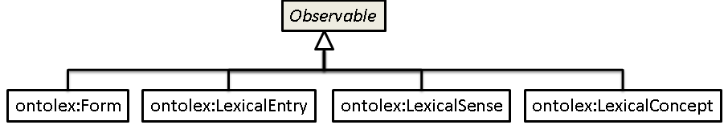

<section id="abstract">

## Abstract

This document describes the _module for frequency, attestation and corpus information_ of the OntoLex Lexicon Model for Ontologies (_OntoLex-Lemon_) developed by the W3C Community Group Ontology-Lexica. The module is targeted at complementing dictionaries and other linguistic resources containing lexicographic data with a vocabulary to express

*   corpus-derived information (frequency and cooccurrence information, collocation analysis),
*   pointers from lexical resources to corpora and other collections of text (attestations, examples), and the linking of these resources with lexical information (dictionary linking). For simplicity, this document uses the term corpus to broadly include primary linguistic data, individual texts, or documents, and
*   the linking of corpora and linguistic primary data with lexical information (dictionary linking).

The module tackles use cases in corpus-based lexicography and corpus linguistics and operates in combination with the _OntoLex-Lemon_ core module (_Lemon_), as well as with other _lemon_ modules.
</section>

<section id="sotd">

This document is an official report of the OntoLex community group. It does not represent the view of single individuals but reflects the consensus and agreement reached as part of the regular group discussions. The report should be regarded as the official specification of lemon.

If you wish to make comments regarding this document, please send them to public-ontolex@w3.org (subscribe, archives).

</section>

<section id="introduction">

## Introduction

[OntoLex-Lemon](https://www.w3.org/2016/05/ontolex/) provides a [core](https://www.w3.org/2016/05/ontolex/#core) vocabulary to represent _linguistic information_ associated with ontology and vocabulary elements. The model follows the principle of _semantics by reference_ in the sense that the semantics of a [lexical entry](https://www.w3.org/2016/05/ontolex/#LexicalEntry) is expressed by reference to an individual, class or property defined in an ontology. The OntoLex module for Frequency, Attestations and Corpus-Based Information (OntoLex-FrAC) complements OntoLex-Lemon with the capability of including information drawn from or found in corpora and linguistic primary data.

In particular, the model's primary motivation is to provide a means to link lexical resources to corpora and other collections of text, and to express the relationship between lexical information and the primary data from which it is derived. As such this module will:

1.  Extend the use of OntoLex-Lemon to support digital lexicography,
2.  Contribute to the integration of lexicography, AI and human language technology communities,
3.  Provide a method of representing this information in a way that is compatible with the existing OntoLex-Lemon model.

<section id="namespaces">

### Namespaces

This is a list of relevant namespaces that will be used in the rest of this document:

OntoLex module for frequency, attestation and corpus information

```
@prefix frac: <http://www.w3.org/ns/lemon/frac#> .
```

OntoLex (core) model and other _lemon_ modules:

```turtle
@prefix ontolex: <http://www.w3.org/ns/lemon/ontolex#> .
@prefix synsem: <http://www.w3.org/ns/lemon/synsem#> .
@prefix decomp: <http://www.w3.org/ns/lemon/decomp#> .
@prefix vartrans: <http://www.w3.org/ns/lemon/vartrans#> .
@prefix lime: <http://www.w3.org/ns/lemon/lime#> .
@prefix lexicog: <http://www.w3.org/ns/lemon/lexicog#> .
```

Other models:

```turtle
@prefix rdf: <http://www.w3.org/1999/02/22-rdf-syntax-ns#>.
@prefix rdfs: <http://www.w3.org/2000/01/rdf-schema#>.
@prefix owl: <http://www.w3.org/2002/07/owl#>.
@prefix xsd: <http://www.w3.org/2001/XMLSchema#>.
@prefix lexinfo: <http://www.lexinfo.net/ontology/3.0/lexinfo#>.
@prefix dct: <http://purl.org/dc/terms/>.
@prefix oa: <http://www.w3.org/ns/oa#>.
@prefix dcterms: <http://purl.org/dc/terms/> .
```
</section>

<section id="glossary">

### Glossary of Terms

* **[=Attestation=]**
  A quotation or excerpt from a source document providing evidence of a lexical feature (e.g., form, sense, spelling variation). It is a subclass of [=Observation=].
* **[=Citation=]**
  A general bibliographic reference from a lexical resource to a source. [=Attestation property=] is a more specific form of <dfn>citation</dfn>.
* **[=Collocation=]**
  A co-occurrence of two or more lexical units in a corpus. Treated as a container ([`rdf:Seq`](http://www.w3.org/1999/02/22-rdf-syntax-ns#Seq) or [`rdf:Bag`](http://www.w3.org/1999/02/22-rdf-syntax-ns#Bag)) and a subclass of [=Observation=].
* **[=Collocation Score=]**
  A subproperty of [`rdf:value`](http://www.w3.org/1999/02/22-rdf-syntax-ns#value), used to represent specific statistical scores for collocations (e.g., PMI, Dice, Log-Likelihood). Not used directly—see sub-properties like [`lexinfo:pmi`](http://www.lexinfo.net/ontology/3.0/lexinfo#pmi).
* **Corpus**
  A collection of texts (e.g., [`dct:Collection`](http://purl.org/dc/terms/Collection), [`dct:Dataset`](http://purl.org/dc/terms/Dataset)), a single text, document, or primary linguistic data used as the empirical basis for observations. In this specification, the term "corpus" is used as an umbrella term encompassing all such forms of primary linguistic data and text collections. Referenced via [=observedIn=].
* **[=Frequency=]**
  An observation of how often an observable appears in a corpus (absolute count), subclass of [=Observation=].
* **[=head=]**
  Identifies the target element in a collocation for asymmetric metrics (e.g., relative frequency, confidence).
* **[=locus=]**
  Indicates the precise location (e.g., character offsets, URI fragments) of an attestation in a source text.
* **[=Observable=]**
  Any lexical or ontological unit about which corpus-based information (frequency, attestation) can be recorded.
* **[=Observation=]**
  An empirical claim about an observable—e.g., frequency count, collocation, attestation. Can link to a data source via [=observedIn=].
* **[`rdf:value`](http://www.w3.org/1999/02/22-rdf-syntax-ns#value)**
  A standard RDF property used to specify the literal value of an observation (e.g., a frequency number or attestation text).
* **[=unit=]**
  Indicates the segmentation unit used in a frequency count (e.g., `"tokens"`, `"sentences"`). Applied to [=Frequency=].
* **`Web Annotation`**
  A model for linking annotations to web resources. Used in FrAC to annotate corpora with lexical info via [`oa:hasBody`](https://www.w3.org/TR/annotation-vocab/#hasbody), [`oa:hasTarget`](https://www.w3.org/TR/annotation-vocab/#hastarget), and selectors (e.g., [`oa:TextPositionSelector`](https://www.w3.org/TR/annotation-vocab/#textpositionselector)).
* **`OntoLex-Lemon`**
  A core vocabulary for linking lexical information with ontologies. FrAC extends it to cover corpus-based data.

</section>

<section id="overview">

### Overview of the Module

The following diagram depicts the OntoLex module for frequency, attestation and corpus information (_OntoLex-FrAC_). Boxes represent classes of the model. Arrows with filled heads represent object properties. Arrows with empty diamond heads represent [`rdfs:subClassOf`](http://www.w3.org/2000/01/rdf-schema#subClassOf).


<figure id="overview-figure">

, overview")

<figcaption>OntoLex Module for Frequency, Attestation and Corpus Information (_FrAC_), overview</figcaption>

</figure>

</section>
</section>

<section id="observations">

## Observations and Observables

OntoLex-FrAC provides the necessary vocabulary to express *observations* obtained from a language resource about any linguistic or conceptual entity that can be observed in a corpus ("observable"). By observable, we mean any element for which corpus-based observations are explicitly recorded. This includes:

- Any lexical entity defined within an OntoLex lexical resource (e.g., <a data-cite="ontolex#LexicalEntry">lexical entry</a>, <a data-cite="ontolex#Form">form</a>, <a data-cite="ontolex#LexicalSense">lexical sense</a>, or <a data-cite="ontolex#LexicalConcept">lexical concept</a>).  
- Any ontological entity or concept referenced by a lexical resource via semantic mapping properties (specifically the object of an <a data-cite="ontolex#denotes">denotes</a>, <a data-cite="ontolex#reference">reference</a>, or <a data-cite="ontolex#isConceptOf">isConceptOf</a> property).  

While a corpus may contain various annotations (such as part-of-speech tags or 
syntactic relations), these are only treated as [=observable=] when they are
directly mapped to or quantified within the lexical resource. For the purposes of
this document, the terms ontology and knowledge graph are used interchangeably to
refer to the formal conceptual models that provide these semantic targets. 

The top-level concepts of OntoLex-FrAC are thus [=observable=] and 
[=Observation=], complemented by a property [=observedIn=], 
pointing to the URI where the observation has been made.

<div class="entity">

<class>Observable</class>

**URI:** [http://www.w3.org/ns/lemon/frac#Observable](http://www.w3.org/ns/lemon/frac#Observable)

<dfn>Observable</dfn> is a superclass for any element of a lexical resource that frequency, attestation or corpus-derived information can be expressed about. This includes, among others, <a data-cite="ontolex#LexicalEntry">lexical entry</a>, <a data-cite="ontolex#LexicalSense">lexical sense</a>, <a data-cite="ontolex#Form">form</a>, and <a data-cite="ontolex#LexicalConcept">lexical concept</a>. Elements that FrAC properties apply to must be observable in a corpus or another linguistic data source.
</div>

</div>

<figure>



<figcaption>[=Observable=] as a superclass of <a data-cite="ontolex#LexicalEntry">lexical entry</a>, <a data-cite="ontolex#Form">form</a>, <a data-cite="ontolex#LexicalSense">lexical sense</a> and <a data-cite="ontolex#LexicalConcept">lexical concept</a></figcaption>

</figure>

We assume that frequency, attestation and corpus information can be provided about _every_ linguistic content element in the OntoLex-Lemon core model and in existing or forthcoming OntoLex modules. This includes <a data-cite="ontolex#Form">form</a> (e.g., form frequency), <a data-cite="ontolex#LexicalEntry">lexical entry</a> (e.g., frequency of disambiguated lemmas), <a data-cite="ontolex#LexicalSense">lexical sense</a> (e.g., sense frequency), <a data-cite="ontolex#LexicalConcept">lexical concept</a> (e.g., synset frequency), [`lexicog:Entry`](http://www.w3.org/ns/lemon/lexicog#Entry) (if used for representing homonyms: frequency of non-disambiguated lemmas).
In particular, we consider all these elements to be countable, annotatable and attestable. For this reason, we introduce [=observable=] as a top-level element within the FrAC module that is used to define the [`rdfs:domain`](http://www.w3.org/2000/01/rdf-schema#domain) of all the properties that link lexical and corpus-derived information. 

<div class="note">
The definition of [=observable=] does not posit an exhaustive list of possible observables. Instead, anything that can be observed in a corpus can be defined as [=observable=]. This includes elements of OntoLex modules not listed here (e.g., <a data-cite="decomp#component">component</a>, <a data-cite="synsem#SyntacticArgument">syntactic argument</a>, etc.) or future OntoLex vocabularies. Likewise, it can also include URIs which have no relation to OntoLex whatsoever, as these are foreseen as external elements that OntoLex-Lemon can provide information about, but only if they are based on or linked with corpus information, attested in a document, a text or its annotations.
</div>

<div class="entity">

<class>Observation</class>

**URI:** [http://www.w3.org/ns/lemon/frac#Observation](http://www.w3.org/ns/lemon/frac#Observation)

<dfn>Observation</dfn> is a superclass for anything that can be observed in a corpus about an [=observable=]. 

<div class="description">

<subclass>exactly 1 [=observedIn=]</subclass>

<subclass>min 1 [`dct:description`](http://purl.org/dc/terms/description)</subclass>

<subclass>exactly 1 [`rdf:value`](http://www.w3.org/1999/02/22-rdf-syntax-ns#value)</subclass>

</div>

</div>

Observations as understood here are **empirical** (quantitative) observations that are made against a corpus, a text, a document or another type of language data. Observations can be made in any kind of (collection or excerpt of) linguistic data at any scale, structured or unstructured, regardless of its physical materialization (as an electronic corpus, as a series of printed books, as a bibliographical database or as metadata record for a particular corpus).

<div class="entity">

<objectProperty>observedIn</objectProperty>

**URI:** [http://www.w3.org/ns/lemon/frac#observedIn](http://www.w3.org/ns/lemon/frac#Observation)

For an [=Observation=],  the property <dfn>observedIn</dfn> defines the URI of the data source (or its metadata entry) that this particular observation was made in or derived from. This can be, for example, a corpus or a text represented by its access URL, a book represented by its bibliographical metadata, etc.

<div class="description">

<domain>[=Observation=]</domain>

<range>anyURI</range>

<functional/>

</div>
</div>

</section>

<section id="frequency">

## Frequency

Lexicographers use (corpus) frequency and distribution information while compiling lexical entries, as a quantitative assessment of their resources. In this module, we focus on absolute frequencies, as relative frequencies can be derived if absolute frequencies and token totals are known. Absolute frequencies are used in computational lexicography and they are an essential piece of information for NLP and corpus linguistics.

<div class="entity">

<class>Frequency</class>

**URI:** [http://www.w3.org/ns/lemon/frac#Frequency](http://www.w3.org/ns/lemon/frac#Frequency)

<dfn>Frequency</dfn> is an [=Observation=] of the absolute number of attestations ([`rdf:value`](http://www.w3.org/1999/02/22-rdf-syntax-ns#value)) of a particular [=observable=] (see [=frequency property=]) that is [=observedIn=] in a particular data source. Using [=unit=], frequency objects can also identify the (segmentation) unit that their counts are based on. 
<div class="description">

<subclass>[=Observation=]</subclass>

<subclass>[`rdf:value`](http://www.w3.org/1999/02/22-rdf-syntax-ns#value) exactly 1</subclass>

<subclass>[=observedIn=] exactly 1</subclass>

</div>


</div>

A frequency should have a unit that specifies the segmentation unit of the frequency count. This can be, for example, "tokens", "types", "lemmas", "sentences", "paragraphs", etc. 

<div class="entity">

<objectProperty>unit</objectProperty>

**URI:** [http://www.w3.org/ns/lemon/frac#unit](http://www.w3.org/ns/lemon/frac#unit)

For a [=Frequency=] object, the property <dfn>unit</dfn> provides an identifier of the respective segmentation unit.

<div class="description">

<domain>[=Frequency=]</domain>

</div>
</div>

Values for [=unit=] are defined in an external ontology such as LexInfo, which defines the meaning of common elements such as "tokens", "types", "sentences". You may define custom values as required, which should be documented clearly.

<div class="entity">

<objectProperty>frequency</objectProperty>

**URI:** [http://www.w3.org/ns/lemon/frac#frequency](http://www.w3.org/ns/lemon/frac#frequency)

The <dfn>frequency property</dfn> assigns a particular [=observable=] a [=Frequency=].

<div class="description">

<domain>[=observable=]</domain>

<range>[=Frequency=]</range>
</div>
</div>

<div class="note">

There is only a single data source, in which the frequency is observed, so the 
frequency value should correspond to the aggregation of sources and languages 
in that dataset.
</div>

The definition above only applies to absolute frequencies. For expressing relative frequencies, we expect the associated data source ([=observedIn=]) object to define a total of elements contained ([=total=]). In many practical applications, it is necessary to provide relative counts, and in this way, these can be easily derived from the absolute (element) frequency provided by the [=Frequency=] class and the total defined by the underlying corpus. If the real absolute values are unknown and only relative scores are provided, data providers should use percentage values for both the [=Frequency=] [`rdf:value`](http://www.w3.org/1999/02/22-rdf-syntax-ns#value) and for the [=total=] (i.e., `100%`) of the associated corpus.

A simple example of indicating the frequency of a word in a corpus is given below:

<aside class="example" title="Frequency of the word 'cat' in the WordNet Glosstag Corpus">

```turtle
:cat-n a ontolex:LexicalEntry ;
  ontolex:denotes :oewn-02124272-n,
    :oewn-02130460-n .

:oewn-02124272-n ;
  skos:definition "feline mammal usually having thick soft fur and no ability to roar: domestic cats; wildcats"@en ;
  frac:frequency [
    a frac:Frequency ;
    rdf:value 46
    frac:observedIn <https://wordnetcode.princeton.edu/glosstag.shtml> 
  ]
] .

:oewn-02130460-n ;
  skos:definition "any of several large cats typically able to roar and living in the wild"@en ;
  frac:frequency [
    a frac:Frequency ;
    rdf:value 4
    frac:observedIn <https://wordnetcode.princeton.edu/glosstag.shtml> 
  ]
] .
```

</aside>

<div class="note">

The identifiers and data are drawn from the [Open English Wordnet](https://en-word.net)
project, however, they are simplified for explanatory purposes.

</div>

The following example illustrates word and form frequencies for the Sumerian word _a_ (n.) "water" from the [Electronic Penn Sumerian Dictionary](http://oracc.museum.upenn.edu/epsd2/sux) and the frequencies of the underlying corpus.

<aside class="example" title="Frequency of the Sumerian word _a_ 'water'">

```turtle
# word frequency, over all form variants 
epsd:kalag_strong_v a ontolex:LexicalEntry;
    frac:frequency [
        a frac:Frequency; 
        rdf:value "2398"^^xsd:int; 
        frac:observedIn <http://oracc.museum.upenn.edu/epsd2/pager>
    ] .

# form frequency for individual orthographical variants 
epsd:kalag_strong_v ontolex:canonicalForm [
    ontolex:writtenRep "kal-ga"@sux-Latn; 
    frac:frequency [
        a frac:Frequency; 
        rdf:value "2312"^^xsd:int; 
        frac:observedIn <http://oracc.museum.upenn.edu/epsd2/pager>
        ]
    ] .

epsd:kalag_strong_v ontolex:otherForm [ 
    ontolex:writtenRep "kalag"@sux-Latn; 
    frac:frequency [ 
        a frac:Frequency; 
        rdf:value "70"^^xsd:int; 
        frac:observedIn <http://oracc.museum.upenn.edu/epsd2/pager>
        ]
    ] .
```

</aside>

The example shows an orthographic variation (in the Latin transcription). 
It is slightly simplified insofar as the ePSD2 provides individual counts for different periods and only three of six orthographical variants are given. Note that these are orthographical variants, not morphological variants (which are not given in the dictionary).

<div class="entity">

<objectProperty>total</objectProperty>

**URI:** [http://www.w3.org/ns/lemon/frac#total](http://www.w3.org/ns/lemon/frac#total)

The object property <dfn>total</dfn> assigns  any potential FrAC data source (i.e., [`dct:Collection`](http://purl.org/dc/terms/Collection), [`dct:Dataset`](http://purl.org/dc/terms/Dataset), [`dct:Text`](http://purl.org/dc/terms/Text) or any other member of DCMI Type) the  total  number  of  elements  that  it  contains as a [=Frequency=] object.

<div class="description">

<domain>class that is a [`dcam:memberOf`](http://purl.org/dc/dcam/memberOf) DCMI Type</domain>

<range>[=Frequency=]</range>

</div>
</div>

<div class="note">

For [=total=], users should provide both the frequency and the segmentation/unit over which this frequency is obtained. For an observable, relative frequencies (for any given unit *u*) can then be calculated from the object values of `frac:frequency/rdf:value`  and `frac:frequency/frac:observedIn/frac:total/rdf:value` if (and only if) the corresponding units match.

</div>

An example of the use of [=total=] is given below:

<aside class="example" title="Total number of words in the WordNet Glosstag Corpus">

```turtle
<https://wordnetcode.princeton.edu/glosstag.shtml> a dct:Collection ;
  frac:total [
    a frac:Frequency ;
    rdf:value 1634691 ;
    frac:unit lexinfo:tokens
  ] .
```

</aside>

</section>

<section id="attestation-citation">

## Corpus Attestations

While frequency information is used to provide quantitative information about a lexical item, attestations are used to provide qualitative information about the occurrence of a lexical item in a corpus or other linguistic data. This section introduces mechanisms for representing attestations in the OntoLex-FrAC model.

<section id="attestation">

## Attestations

Attestations represent a reference to a specific occurrence of a lexical item in a corpus or other linguistic data. They are used to provide evidence for the existence of a particular lexical phenomenon, such as a word, phrase, or grammatical structure, in a specific context. Attestations can help elucidate meaning, illustrate various linguistic features, and provide examples of usage.

<div class="entity">

<class>Attestation</class>

**URI:** [http://www.w3.org/ns/lemon/frac#Attestation](http://www.w3.org/ns/lemon/frac#Attestation)

<dfn>Attestation</dfn> is an [=Observation=] that represents one exact or normalized quotation or excerpt from a source document that illustrates a particular form, sense, lexeme or features such as spelling variation, morphology, syntax, collocation, register. 

<div class="description">

<subclass>[=quotedText=] max 1</subclass>

<subclass>[=Observation=]</subclass>
</div>
</div>

Attestations are linked with the [=attestation property=] to the [=observable=] they attest. 

<div class="entity">

<objectProperty>attestation</objectProperty>

**URI:** [http://www.w3.org/ns/lemon/frac#attestation](http://www.w3.org/ns/lemon/frac#attestation)

The <dfn>attestation property</dfn> associates an attestation to the [=observable=]. 

<div class="description">

<domain>[=observable=]</domain>

<range>[=Attestation=]</range>

</div>
</div>

The value of the attestation can be give with the [=quotedText=] property, which gives the text of the attestation as it is represented in the original source. This can be a plain text string, or a more complex representation, e.g., as an HTML fragment, or as a reference to a Web Annotation.

<div class="entity">

<dataProperty>quotedText</dataProperty>

**URI:** [http://www.w3.org/ns/lemon/frac#quotedText](http://www.w3.org/ns/lemon/frac#quotedText)

The <dfn>quotedText</dfn> property provides the text of the attestation as it is represented in the original source. This can be a plain text string, or a more complex representation, e.g., as an HTML fragment, or as a reference to a Web Annotation.

<div class="description">

<domain>[=Attestation=]</domain>

<range>[`xsd:string`](https://www.w3.org/TR/xmlschema-2/#string)</range>

</div>
</div>


As an example of an attestation, consider the following example from Open English Wordnet:

<aside class="example" title="Attestation of the word 'cat' in the WordNet Glosstag Corpus">

```turtle
:02105605-a a skos:Concept ;
 skos:definition "concerned chiefly or only with yourself and your advantage 
   to the exclusion of others"@en ;
 frac:attestation [
   frac:quotedText "We're asked to see Rachel as this spoilt, self-centred woman 
     but the rest of them are just as bad, if not worse."@en ;
   frac:observedIn <https://www.newstatesman.com/culture/tv/2023/10/
                    friends-comedy-humour-legacy-matthew-perry> ] .
```

</aside>

</section>

<section id="locus">

## Locus

In many applications, it is desirable to specify the precise location of the occurrence of a headword in the quoted text of an attestation, for example, by means of character offsets. The FrAC standard supports referencing using [RFC5147](https://www.rfc-editor.org/rfc/rfc5147.html) character offsets, [Text Fragments](https://developer.mozilla.org/en-US/docs/Web/URI/Reference/Fragment/Text_fragments), [NIF](https://persistence.uni-leipzig.org/nlp2rdf/) URIs, or by means of [Web Annotation](https://www.w3.org/TR/annotation-model/) references (see Section 6). As different vocabularies can be used to establish locus objects, the FrAC vocabulary is underspecified with respect to the exact nature of the locus object. Accordingly, the [=locus=] property that links an attestation with its source takes any URI as its object.

<div class="entity">

<objectProperty>locus</objectProperty>

**URI:** [http://www.w3.org/ns/lemon/frac#locus](http://www.w3.org/ns/lemon/frac#locus)

<dfn>locus</dfn> points to the location at which the relevant word(s) can be found.

<div class="description">

<domain>[=Attestation=]</domain>
</div>
</div>


<aside class="example" title="Locus of the term 'lexical entry' in the OntoLex specification">

```turtle
:lexical_entry a ontolex:LexicalEntry ;
 ontolex:canonicalForm [
   ontolex:writtenRep "lexical entry" ;
   frac:attestation [
     a frac:Attestation ;
     frac:quotedText "lexical entry" ;
     frac:locus 
    <https://www.w3.org/2016/05/ontolex/#:~:text=of%20a-,lexical%20entry,-is%20expressed> ;
     frac:observedIn <https://www.w3.org/TR/ontolex/>
   ]
 ] .
```
</aside>

[=locus=] denotes a specific location within a text, e.g., a character offset or a URI pointing to a specific location in a text. In contrast, [=observedIn=] can refer to a corpus of other collections of texts. [=locus=] normally refers to a location identified by RFC5147 character offsets, NIF URIs, Web Annotation or Text Fragments references, whereas [=observedIn=] refers to [`dct:Text`](http://purl.org/dc/terms/Text)s or [`dct:Collection`](http://purl.org/dc/terms/Collection)s.

While a single attestation object may be used for multiple observables, if the [=locus=] property is used to point to the specific location of the observable in the attestation, this may mean that multiple attestations are required, each with a different [=locus=] value. 

</section>
</section>

<section id="collocations">

## Collocations

A collocation is a sequence of words or terms that co-occur more often than would be expected by chance. Often, collocations are idiomatic expressions, but they can also be more general, such as "strong tea" or "heavy rain".

Collocation analysis is an important tool for lexicographical research and instrumental for modern NLP techniques. It has been the mainstay of 1990s corpus linguistics and continues to be an area of active research in this field as well as in computational philology and lexicography.

Collocations are usually defined on surface-oriented criteria, i.e., as a 
relation between forms or lemmas (lexical entries), not between senses, but 
they can be analyzed on the level of word senses (the sense that gave rise to 
the idiom or collocation). Indeed, collocations often contain a variable part, 
which can be represented by a <a data-cite="ontolex#LexicalConcept">lexical concept</a>. For example, 
consider the semi-fixed expression pay [a price] where the verb "pay" is paired with a 
variable semantic slot rather than a single fixed word. By including the abstract 
<a data-cite="ontolex#LexicalConcept">lexical concept</a> instead of a literal form, the collocation successfully 
captures a wide range of corpus occurrences sharing the same underlying meaning, 
such as pay a high price, pay a heavy toll, or pay the ultimate penalty.

<aside class="example" title="Collocation with a Variable Part">
```turtle
ex:pay_verb a ontolex:LexicalEntry ;
    ontolex:canonicalForm [ ontolex:writtenRep "pay"@en ] .

ex:concept_price a ontolex:LexicalConcept ;
    skos:prefLabel "cost or penalty concept"@en .

ex:pay_price_collocation a frac:Collocation, rdf:Seq ;
    rdf:_1 ex:pay_verb ;
    rdf:_2 ex:concept_price ;
    frac:head ex:pay_verb ;
    frac:observedIn <http://example.org/corpora/en_modern_prose> ;
    lexinfo:logDice "7.42"^^xsd:decimal .
```
</aside>

Collocations can involve two or more words, they are thus modelled as an [`rdfs:Container`](http://www.w3.org/2000/01/rdf-schema#Container) of [=observable=]s. Collocations may have a fixed or a variable word order. Where fixed word order is required, the collocation must be defined as a sequence ([`rdf:Seq`](http://www.w3.org/1999/02/22-rdf-syntax-ns#Seq)), otherwise, the default interpretation is as an ordered set ([`rdf:Bag`](http://www.w3.org/1999/02/22-rdf-syntax-ns#Bag)).

Collocations obtained by quantitative methods are characterized by their method of creation ([`dct:description`](http://purl.org/dc/terms/description)), their collocation strength ([`rdf:value`](http://www.w3.org/1999/02/22-rdf-syntax-ns#value)), and the corpus or data source used to create them ([=observedIn=]). Collocations share these characteristics with other [=Observation=]s and thus, these are inherited from the [=Observation=] class.


<div class="entity">

<class>Collocation</class>

**URI:** [http://www.w3.org/ns/lemon/frac#Collocation](http://www.w3.org/ns/lemon/frac#Collocation)

<dfn>Collocation</dfn> is an [=Observation=] that describes the co-occurrence of two or more [=observable=]s within the same context window and that can be characterized by their collocation score (or weight, [`rdf:value`](http://www.w3.org/1999/02/22-rdf-syntax-ns#value)) in a particular data source ([=observedIn=]). 

<div class="description">

<subclass>[`rdfs:Container`](http://www.w3.org/2000/01/rdf-schema#Container)</subclass>

<subclass>[=Observation=]</subclass>

<subclass>[`rdfs:member`](http://www.w3.org/2000/01/rdf-schema#member) only [=observable=]</subclass>

<subclass>[=head=] max 1</subclass>
</div>
</div>

Collocations are collections of [=observable=]s, and formalized as [`rdfs:Container`](http://www.w3.org/2000/01/rdf-schema#Container), i.e., [`rdf:Seq`](http://www.w3.org/1999/02/22-rdf-syntax-ns#Seq) or [`rdf:Bag`](http://www.w3.org/1999/02/22-rdf-syntax-ns#Bag). The elements of any collocation can be accessed by [`rdfs:member`](http://www.w3.org/2000/01/rdf-schema#member). In addition, the elements of an ordered collocation (`rdfs:subClassOf rdf:Seq`) can be accessed by means of numerical indices (`rdf:_1`, `rdf:_2`, etc.). 
    
By default, [=Collocation=] is insensitive to word order. If a collocation is word order sensitive, it should be defined as `rdfs:subClassOf rdf:Seq`. Collocation analysis typically involves additional parameters such as the size of the context window considered. Such information can be provided in human-readable form in [`dct:description`](http://purl.org/dc/terms/description). 

FrAC collocations can be used to represent collocations both in the quantitative sense (as determined by collocation metrics over a particular corpus). Collocations in the lexicographic sense (as complex units of meaning) are represented using the [OntoLex Decomposition Module](https://www.w3.org/community/ontolex/wiki/Final_Model_Specification#Decomposition_(decomp)) or by using a property such as [`lexinfo:termType`](http://www.lexinfo.net/ontology/3.0/lexinfo#termType), e.g., by means of [`lexinfo:idiom`](http://www.lexinfo.net/ontology/3.0/lexinfo#idiom), [`lexinfo:phraseologicalUnit`](http://www.lexinfo.net/ontology/3.0/lexinfo#phraseologicalUnit) or [`lexinfo:setPhrase`](http://www.lexinfo.net/ontology/3.0/lexinfo#setPhrase). If explicit sense information is being provided, the recommended modelling is by means of <a data-cite="ontolex#MultiwordExpression">multiword expression</a> and the OntoLex-Decomp module rather than [=Collocation=]. To provide collocation scores about a <a data-cite="ontolex#MultiwordExpression">multiword expression</a>, it can be linked via [`rdfs:member`](http://www.w3.org/2000/01/rdf-schema#member) with a [=Collocation=].
    
Since collocations are [=observable=]s, they can be ascribed [=frequency property=], and [=attestation property=] and they can be nested inside larger collocations.
    
Collocations can be described in terms of various collocation scores. If scores for multiple metrics are being provided, these should not use the generic [`rdf:value`](http://www.w3.org/1999/02/22-rdf-syntax-ns#value) property, but a designated subproperty of [=cScore=]:

<div class="entity">

<dataProperty>cScore</dataProperty>

**URI:** [http://www.w3.org/ns/lemon/frac#cScore](http://www.w3.org/ns/lemon/frac#cScore)

<dfn data-lt="cScore">Collocation score</dfn> is a subproperty of [`rdf:value`](http://www.w3.org/1999/02/22-rdf-syntax-ns#value) that provides the value for one specific type of collocation score for a particular collocation in its respective corpus. Note that this property should not be used directly, but instead, its respective sub-properties for scores of a particular type.

<div class="description">

<subproperty>[`rdf:value`](http://www.w3.org/1999/02/22-rdf-syntax-ns#value)</subproperty>

<domain>[=Collocation=]</domain>
</div>
</div>

LexInfo defines a number of popular collocation metrics as sub-properties of [=cScore=]:

- [`lexinfo:relFreq`](http://www.lexinfo.net/ontology/3.0/lexinfo#relFreq) (*relative frequency*): <math><mrow><mi>R</mi><mi>F</mi><mo form="prefix" stretchy="false">(</mo><mi>x</mi><mo separator="true">,</mo><mi>y</mi><mi>|</mi><mi>x</mi><mo form="postfix" stretchy="false">)</mo><mo>=</mo><mfrac><msub><mi>f</mi><mrow><mi>x</mi><mi>y</mi></mrow></msub><msub><mi>f</mi><mi>x</mi></msub></mfrac><mo form="prefix" stretchy="false">(</mo><mo>=</mo><msub><mi>R</mi><mi>x</mi></msub><mo form="postfix" stretchy="false">)</mo></mrow></math> (asymmetric, requires [=head=])
- [`lexinfo:pmi`](http://www.lexinfo.net/ontology/3.0/lexinfo#pmi) (*pointwise mutual information*, sometimes referred to as *MI-score* or *association ratio*, cf. [Church and Hanks 1990, via Ewert 2005](https://elib.uni-stuttgart.de/bitstream/11682/2573/1/Evert2005phd.pdf): <math><mrow><mi>PMI</mi><mo form="prefix" stretchy="false">(</mo><mi>x</mi><mo separator="true">,</mo><mi>y</mi><mo form="postfix" stretchy="false">)</mo><mo>=</mo><mi>l</mi><mi>o</mi><msub><mi>g</mi><mn>2</mn></msub><mfrac><mrow><msub><mi>f</mi><mrow><mi>x</mi><mi>y</mi></mrow></msub><mi>N</mi></mrow><mrow><msub><mi>f</mi><mi>x</mi></msub><msub><mi>f</mi><mi>y</mi></msub></mrow></mfrac></mrow></math>
- [`lexinfo:pmi2`](http://www.lexinfo.net/ontology/3.0/lexinfo#pmi2) (*PMI²-score*): <math><mrow><msup><mi>PMI</mi><mn>2</mn></msup><mo form="prefix" stretchy="false">(</mo><mi>x</mi><mo separator="true">,</mo><mi>y</mi><mo form="postfix" stretchy="false">)</mo><mo>=</mo><mi>l</mi><mi>o</mi><msub><mi>g</mi><mn>2</mn></msub><mfrac><mrow><msubsup><mi>f</mi><mrow><mi>x</mi><mi>y</mi></mrow><mn>2</mn></msubsup><mi>N</mi></mrow><mrow><msub><mi>f</mi><mi>x</mi></msub><msub><mi>f</mi><mi>y</mi></msub></mrow></mfrac></mrow></math>
- [`lexinfo:pmi3`](http://www.lexinfo.net/ontology/3.0/lexinfo#pmi3) (*PMI³-score*, cf. [Daille 1994 in Ebert 2005, p.89](https://elib.uni-stuttgart.de/bitstream/11682/2573/1/Evert2005phd.pdf)): <math><mrow><msup><mi>PMI</mi><mn>3</mn></msup><mo form="prefix" stretchy="false">(</mo><mi>x</mi><mo separator="true">,</mo><mi>y</mi><mo form="postfix" stretchy="false">)</mo><mo>=</mo><mi>l</mi><mi>o</mi><msub><mi>g</mi><mn>2</mn></msub><mfrac><mrow><msubsup><mi>f</mi><mrow><mi>x</mi><mi>y</mi></mrow><mn>3</mn></msubsup><mi>N</mi></mrow><mrow><msub><mi>f</mi><mi>x</mi></msub><msub><mi>f</mi><mi>y</mi></msub></mrow></mfrac></mrow></math>
- [`lexinfo:pmiLogFreq`](http://www.lexinfo.net/ontology/3.0/lexinfo#pmiLogFreq) (*PMI.log-f*, *salience*, formerly default metric in SketchEngine): <math><mrow><mi>P</mi><mi>M</mi><mi>I</mi><mi>.</mi><mi>l</mi><mi>o</mi><mi>g</mi><mo>−</mo><mi>f</mi><mo form="prefix" stretchy="false">(</mo><mi>x</mi><mo separator="true">,</mo><mi>y</mi><mo form="postfix" stretchy="false">)</mo><mo>=</mo><mi>l</mi><mi>o</mi><msub><mi>g</mi><mn>2</mn></msub><mfrac><mrow><msub><mi>f</mi><mrow><mi>x</mi><mi>y</mi></mrow></msub><mi>N</mi></mrow><mrow><msub><mi>f</mi><mi>x</mi></msub><msub><mi>f</mi><mi>y</mi></msub></mrow></mfrac><mo>×</mo><mi>l</mi><mi>o</mi><mi>g</mi><msub><mi>f</mi><mrow><mi>x</mi><mi>y</mi></mrow></msub></mrow></math>
- [`lexinfo:dice`](http://www.lexinfo.net/ontology/3.0/lexinfo#dice) (*Dice coefficient*): <math><mrow><mi>D</mi><mi>i</mi><mi>c</mi><mi>e</mi><mo form="prefix" stretchy="false">(</mo><mi>x</mi><mo separator="true">,</mo><mi>y</mi><mo form="postfix" stretchy="false">)</mo><mo>=</mo><mfrac><mrow><mn>2</mn><msub><mi>f</mi><mrow><mi>x</mi><mi>y</mi></mrow></msub></mrow><mrow><msub><mi>f</mi><mi>x</mi></msub><mo>×</mo><msub><mi>f</mi><mi>y</mi></msub></mrow></mfrac></mrow></math>
- [`lexinfo:logDice`](http://www.lexinfo.net/ontology/3.0/lexinfo#logDice) (default metric in SketchEngine, [Rychly 2008](https://www.sketchengine.eu/wp-content/uploads/2015/03/Lexicographer-Friendly_2008.pdf)): <math><mrow><mi>L</mi><mi>o</mi><mi>g</mi><mi>D</mi><mi>i</mi><mi>c</mi><mi>e</mi><mo form="prefix" stretchy="false">(</mo><mi>x</mi><mo separator="true">,</mo><mi>y</mi><mo form="postfix" stretchy="false">)</mo><mo>=</mo><mi>l</mi><mi>o</mi><msub><mi>g</mi><mn>2</mn></msub><mi>D</mi><mi>i</mi><mi>c</mi><mi>e</mi><mo form="prefix" stretchy="false">(</mo><mi>x</mi><mo separator="true">,</mo><mi>y</mi><mo form="postfix" stretchy="false">)</mo></mrow></math>
- [`lexinfo:minSensitivity`](http://www.lexinfo.net/ontology/3.0/lexinfo#minSensitivity) (*minimum sensitivity*, cf. [Pedersen 1998](https://www.sketchengine.eu/wp-content/uploads/ske-statistics.pdf)): <math><mrow><mi>M</mi><mi>S</mi><mo form="prefix" stretchy="false">(</mo><mi>x</mi><mo separator="true">,</mo><mi>y</mi><mo form="postfix" stretchy="false">)</mo><mo>=</mo></mrow><mrow><mi>m</mi><mi>i</mi><mi>n</mi><mo form="prefix" stretchy="false">(</mo><msub><mi>R</mi><mi>x</mi></msub><mo separator="true">,</mo><msub><mi>R</mi><mi>y</mi></msub><mo form="postfix" stretchy="false">)</mo></mrow></math>

with
    
- <math><mrow><mi>x</mi><mo separator="true">,</mo></mrow><mrow><mi>y</mi></mrow></math> the (head) word and its collocate
- <math><msub><mi>f</mi><mi>x</mi></msub></math> the number of occurrences of the word *x*
- <math><msub><mi>f</mi><mi>y</mi></msub></math> the number of occurrences of the word *y*
- <math><msub><mi>f</mi><mrow><mi>x</mi><mi>y</mi></mrow></msub></math> the number of co-occurrences of the words *x* and *y*
- <math><mrow><msub><mi>R</mi><mi>y</mi></msub><mo>=</mo></mrow><mrow><mfrac><msub><mi>f</mi><mrow><mi>x</mi><mi>y</mi></mrow></msub><msub><mi>f</mi><mi>y</mi></msub></mfrac></mrow></math> relative frequency of *y*
- <math><mi>N</mi></math> the total number of words in the corpus, this should be documented in [`dct:description`](http://purl.org/dc/terms/description)

In addition to collocation scores, also statistical independence tests can be employed as collocation scores:

- [`lexinfo:logLikelihood`](http://www.lexinfo.net/ontology/3.0/lexinfo#logLikelihood) (*log likelihood*, *G²* [Dunning 1993, via Ewer 2005](https://elib.uni-stuttgart.de/bitstream/11682/2573/1/Evert2005phd.pdf))
- [`lexinfo:tScore`](http://www.lexinfo.net/ontology/3.0/lexinfo#tScore) (*Student's t test*, *T-score*, cf. [Church et al. 1991, via Ewert 2005, p.82](https://elib.uni-stuttgart.de/bitstream/11682/2573/1/Evert2005phd.pdf) ): <math><mrow><mi>T</mi><mo form="prefix" stretchy="false">(</mo><mi>x</mi><mo separator="true">,</mo><mi>y</mi><mo form="postfix" stretchy="false">)</mo><mo>=</mo></mrow><mrow><mfrac><mrow><msub><mi>f</mi><mrow><mi>x</mi><mi>y</mi></mrow></msub><mo>−</mo><mfrac><mrow><mo form="prefix" stretchy="false" lspace="0em" rspace="0em">(</mo><msub><mi>f</mi><mi>x</mi></msub><msub><mi>f</mi><mi>y</mi></msub><mo form="postfix" stretchy="false" lspace="0em" rspace="0em">)</mo></mrow><mi>N</mi></mfrac></mrow><msqrt><msub><mi>f</mi><mrow><mi>x</mi><mi>y</mi></mrow></msub></msqrt></mfrac></mrow></math>
- [`lexinfo:chi2`](http://www.lexinfo.net/ontology/3.0/lexinfo#chi2) (*Person's Chi-square test* [Manning 1999](https://nlp.stanford.edu/fsnlp/) ): <math><mrow><msup><mi>χ</mi><mn>2</mn></msup><mo form="prefix" stretchy="false">(</mo><mi>x</mi><mo separator="true">,</mo><mi>y</mi><mo form="postfix" stretchy="false">)</mo><mo>=</mo></mrow><mrow><mfrac><mrow><mi>N</mi><mo form="prefix" stretchy="false">(</mo><msub><mi>O</mi><mn>11</mn></msub><msub><mi>O</mi><mn>22</mn></msub><mo>−</mo><msub><mi>O</mi><mn>12</mn></msub><msub><mi>O</mi><mn>21</mn></msub><msup><mo form="postfix" stretchy="false">)</mo><mn>2</mn></msup></mrow><mrow><mo form="prefix" stretchy="false" lspace="0em" rspace="0em">(</mo><msub><mi>O</mi><mn>11</mn></msub><mo>×</mo><msub><mi>O</mi><mn>12</mn></msub><mo form="postfix" stretchy="false">)</mo><mo form="prefix" stretchy="false">(</mo><msub><mi>O</mi><mn>11</mn></msub><mo>×</mo><msub><mi>O</mi><mn>21</mn></msub><mo form="postfix" stretchy="false">)</mo><mo form="prefix" stretchy="false">(</mo><msub><mi>O</mi><mn>12</mn></msub><mo>×</mo><msub><mi>O</mi><mn>22</mn></msub><mo form="postfix" stretchy="false">)</mo><mo form="prefix" stretchy="false">(</mo><msub><mi>O</mi><mn>21</mn></msub><mo>×</mo><msub><mi>O</mi><mn>22</mn></msub><mo form="postfix" stretchy="false" lspace="0em" rspace="0em">)</mo></mrow></mfrac></mrow></math>

with

- <math><mrow><msub><mi>O</mi><mn>11</mn></msub><mo>=</mo></mrow><mrow><msub><mi>f</mi><mrow><mi>x</mi><mi>y</mi></mrow></msub></mrow></math>
- <math><mrow><msub><mi>O</mi><mn>12</mn></msub><mo>=</mo></mrow><mrow><msub><mi>f</mi><mi>y</mi></msub><mo>−</mo></mrow><mrow><msub><mi>f</mi><mrow><mi>x</mi><mi>y</mi></mrow></msub></mrow></math>
- <math><mrow><msub><mi>O</mi><mn>21</mn></msub><mo>=</mo></mrow><mrow><msub><mi>f</mi><mi>x</mi></msub><mo>−</mo></mrow><mrow><msub><mi>f</mi><mrow><mi>x</mi><mi>y</mi></mrow></msub></mrow></math>
- <math><mrow><msub><mi>O</mi><mn>22</mn></msub><mo>=</mo></mrow><mrow><mi>N</mi><mo>−</mo></mrow><mrow><msub><mi>f</mi><mi>x</mi></msub><mo>−</mo></mrow><mrow><msub><mi>f</mi><mi>y</mi></msub><mo>×</mo></mrow><mrow><mn>2</mn><msub><mi>f</mi><mrow><mi>x</mi><mi>y</mi></mrow></msub></mrow></math>
- <math><mi>N</mi></math> -  the total number of words in the corpus 
    
In addition to classical collocation metrics, as established in computational lexicography and corpus linguistics, related metrics can also be found in different disciplines and are represented here as subproperties of [=cScore=], as well. This includes metrics for association rule mining. In this context, an association  rule (collocation) <math><mrow><mi>x</mi><mo stretchy="false">→</mo></mrow><mrow><mi>y</mi></mrow></math> means that the existence of word *x* implies the existence of word *y* 

- [`lexinfo:support`](http://www.lexinfo.net/ontology/3.0/lexinfo#support) (the *support* is an indication of how frequently the rule appears in the dataset): <math><mrow><mi>s</mi><mi>u</mi><mi>p</mi><mi>p</mi><mi>o</mi><mi>r</mi><mi>t</mi><mo form="prefix" stretchy="false">(</mo><mi>x</mi><mo stretchy="false">→</mo><mi>y</mi><mo form="postfix" stretchy="false">)</mo><mo>=</mo></mrow><mrow><mfrac><msub><mi>f</mi><mrow><mi>x</mi><mi>y</mi></mrow></msub><mi>N</mi></mfrac></mrow></math> (with *N* the total number of collocations)
- [`lexinfo:confidence`](http://www.lexinfo.net/ontology/3.0/lexinfo#confidence) (the *confidence* is an indication of how often the rule has been found to be true): <math><mrow><mi>c</mi><mi>o</mi><mi>n</mi><mi>f</mi><mi>i</mi><mi>d</mi><mi>e</mi><mi>n</mi><mi>c</mi><mi>e</mi><mo form="prefix" stretchy="false">(</mo><mi>x</mi><mo stretchy="false">→</mo><mi>y</mi><mo form="postfix" stretchy="false">)</mo><mo>=</mo></mrow><mrow><mfrac><msub><mi>f</mi><mrow><mi>x</mi><mi>y</mi></mrow></msub><msub><mi>f</mi><mi>x</mi></msub></mfrac></mrow></math>
- [`lexinfo:lift`](http://www.lexinfo.net/ontology/3.0/lexinfo#lift) (the *lift* or *interest* of a rule measures how many times more often *x* and *y* occur together than expected if they are statistically independent): <math><mrow><mi>l</mi><mi>i</mi><mi>f</mi><mi>t</mi><mo form="prefix" stretchy="false">(</mo><mi>x</mi><mo stretchy="false">→</mo><mi>y</mi><mo form="postfix" stretchy="false">)</mo><mo>=</mo></mrow><mrow><mfrac><msub><mi>f</mi><mrow><mi>x</mi><mi>y</mi></mrow></msub><mrow><msub><mi>f</mi><mi>x</mi></msub><msub><mi>f</mi><mi>y</mi></msub></mrow></mfrac></mrow></math>
- [`lexinfo:conviction`](http://www.lexinfo.net/ontology/3.0/lexinfo#conviction) (the *conviction* of a rule is interpreted as the ratio of the expected frequency that *x* occurs without *y*, i.e., the frequency that the rule makes an incorrect prediction, if *x* and *y* are independent divided by the observed frequency of incorrect predictions): <math><mrow><mi>c</mi><mi>o</mi><mi>n</mi><mi>v</mi><mi>i</mi><mi>c</mi><mi>t</mi><mi>i</mi><mi>o</mi><mi>n</mi><mo form="prefix" stretchy="false">(</mo><mi>x</mi><mo stretchy="false">→</mo><mi>y</mi><mo form="postfix" stretchy="false">)</mo><mo>=</mo></mrow><mrow><mfrac><mrow><mo form="prefix" stretchy="false" lspace="0em" rspace="0em">(</mo><mn>1</mn><mo>−</mo><msub><mi>f</mi><mi>y</mi></msub><mo form="postfix" stretchy="false">)</mo><msub><mi>f</mi><mi>x</mi></msub></mrow><mrow><msub><mi>f</mi><mi>x</mi></msub><mo>−</mo><msub><mi>f</mi><mrow><mi>x</mi><mi>y</mi></mrow></msub></mrow></mfrac></mrow></math>
 
<div class="note">
As OntoLex does not provide a generic inventory for grammatical relations, scores defined for grammatical relations are omitted. However, these may be defined by the user.
</div>
    
Many of these metrics are asymmetric and distinguish the lexical element they are about (the head) from its collocate(s). If such metrics are provided, a collocation should explicitly identify its head:


<div class="entity">

<objectProperty>head</objectProperty>

**URI:** [http://www.w3.org/ns/lemon/frac#head](http://www.w3.org/ns/lemon/frac#head)

The <dfn>head</dfn> property identifies the element of a collocation that its scores are about. A collocation must not have more than one head.

<div class="description">

<domain>[=Collocation=]</domain>

<range>[=observable=]</range>
</div>
</div>

As an example, the relative frequency score is the number of occurrences of a collocation relative to the overall frequency of its head.

<div class="note">
The function of the property [=head=] is restricted to indicate the directionality of asymmetric collocation scores. It must not be confused with the notion of "head" in certain fields of linguistics, e.g., dependency syntax. 
</div>

The following example illustrates collocations as provided by the [Wortschatz](http://corpora.uni-leipzig.de/en/res?corpusId=eng_news_2012) portal (scores and definitions as provided for [beans](http://corpora.uni-leipzig.de/en/res?corpusId=eng_news_2012&word=beans), [spill the beans](http://corpora.uni-leipzig.de/en/res?corpusId=eng_news_2012&word=spill+the+beans), etc.

<aside class="example" title="Wortschatz Collocation">

```turtle
@prefix wsen: <http://corpora.uni-leipzig.de/en/res?corpusId=eng_news_2012&word=>
# selected lexical entries
# (we assume that every Wortschatz word is an independent lexical entry)
wsen:beans a ontolex:LexicalEntry;
  ontolex:canonicalForm/ontolex:writtenRep "beans"@en.
wsen:spill a ontolex:LexicalEntry;
  ontolex:canonicalForm/ontolex:writtenRep "spill"@en.
wsen:green a ontolex:LexicalEntry;
  ontolex:canonicalForm/ontolex:writtenRep "green"@en.
wsen:about a ontolex:LexicalEntry;
  ontolex:canonicalForm/ontolex:writtenRep "about"@en

# collocations, non-lexicalized
[ rdfs:member wsen:spill, wsen:beans ] a frac:Collocation;
  rdf:value "182";
  dct:description "cooccurrences in the same sentence, unordered";
  frac:observedIn <http://corpora.uni-leipzig.de/en/res?corpusId=eng_news_2012>.

[ rdf:_1 wsen:green; rdf:_2 wsen:beans ] a frac:Collocation, rdf:Seq ;
  rdf:value "778";
  dct:description "left neighbor cooccurrence";
  frac:observedIn <http://corpora.uni-leipzig.de/en/res?corpusId=eng_news_2012>;
  lexinfo:termType lexinfo:idiom.

 [ rdf:_1 wsen:beans; rdf:_2 wsen:about ] a frac:Collocation, rdf:Seq;
  rdf:value "35";
  dct:description "right neighbor cooccurrence";
  frac:observedIn <http://corpora.uni-leipzig.de/en/res?corpusId=eng_news_2012>;
  lexinfo:termType lexinfo:idiom.

# multi-word expression, lexicalized (!)
wsen:spill+the+beans a ontolex:MultiWordExpression;
  ontolex:canonicalForm/ontolex:writtenRep "spill the beans"@en.

[ rdfs:member wsen:beans, wsen:spill+the+beans ] a frac:Collocation;
  rdf:value "401";
  dct:description "cooccurrences in the same sentence, unordered";
  frac:observedIn <http://corpora.uni-leipzig.de/en/res?corpusId=eng_news_2012>.
```
</aside>


</section>

<section id="annotation">

## Corpus Annotation (non-normative)

<section>

### Web Annotation

The Ontolex Module for Frequency, Attestation and Corpus Information does not specify a vocabulary for annotating corpora or other data with lexical information, as this is being provided by the [Web Annotation Vocabulary](https://www.w3.org/TR/annotation-vocab/). The following description is non-normative as Web Annotation is defined in a separate W3C recommendation. The definitions below are reproduced and refined only insofar as domain and range declarations have been refined to our use case.

In Web Annotation terminology, the annotated element is the ‘target’, the content of the annotation is the ‘body’, and the process and provenance of the annotation is expressed by properties of [`oa:Annotation`](https://www.w3.org/TR/annotation-vocab/#annotation).

<figure>


<figcaption>[`oa:Annotation`](https://www.w3.org/TR/annotation-vocab/#annotation) with properties</figcaption>

</figure>

Annotation as linked with the [`oa:hasBody`](https://www.w3.org/TR/annotation-vocab/#hasbody) and [`oa:hasTarget`](https://www.w3.org/TR/annotation-vocab/#hastarget) properties:

<figure>


<figcaption>[`oa:hasBody`](https://www.w3.org/TR/annotation-vocab/#hasbody)</figcaption>
</figure>

The Web Annotation Vocabulary supports different ways to define targets. This includes:

*   plain URI: The target can be a URI defined within the corpus (e.g., if corpus data is provided as native RDF, or by means of the <tt>@about</tt> attribute in an [HTML/XML+RDFa](https://www.w3.org/TR/rdfa-primer/) document, or by means of <tt>@xml:id</tt> in a [TEI/XML](http://www.tei-c.org/release/doc/tei-p5-doc/en/html/ref-att.global.html) document).
*   string URI: String URIs provide the possibility to point directly to a text fragment in a web document, using the URI schemas as provided by [RFC5147](https://tools.ietf.org/html/rfc5147) (text files only) or [NIF](http://persistence.uni-leipzig.org/nlp2rdf/ontologies/nif-core/nif-core.html#introduction) (all text-based formats).
*   [`oa:TextPositionSelector`](https://www.w3.org/TR/annotation-vocab/#textpositionselector): a range of text defined by the start and end positions of the selection in the stream
*   [`oa:DataPositionSelector`](https://www.w3.org/TR/annotation-vocab/#datapositionselector): a range of data by recording the start and end positions of the selection in the stream
*   [`oa:TextQuoteSelector`](https://www.w3.org/TR/annotation-vocab/#textquoteselector): The TextQuoteSelector describes a range of text by copying it. The TextQuoteSelector can include some of the text immediately before (a prefix) and after (a suffix) to distinguish between multiple copies of the same sequence of characters. If this does suffice for disambiguation, all matching text fragments in the document are being annotated.
*   [`oa:XPathSelector`](https://www.w3.org/TR/annotation-vocab/#xpathselector): select elements and content within a resource that supports the Document Object Model via a specified XPath value.
*   [`oa:RangeSelector`](https://www.w3.org/TR/annotation-vocab/#rangeselector): identify the beginning and the end of the selection by using other Selectors.

<aside class="example" title="Web Annotation">

```turtle
:annotation a oa:Annotation, frac:Attestation ;
  oa:hasTarget :target ;
  frac:locus :target ;
  oa:hasBody :lex_entry .

:target a oa:TexPositionSelector ;
  oa:start 123 ;
  oe:end 456  .

:lex_entry frac:attestation :annotation .
```
</aside>

<div class="note">

[`oa:Annotation`](https://www.w3.org/TR/annotation-vocab/#annotation) explicitly allows _n:m_ relations between elements in OntoLex and elements in the annotated elements. It is thus sufficient for every element to appear in one [`oa:hasBody`](https://www.w3.org/TR/annotation-vocab/#hasbody) statement in order to produce a full annotation of the corpus.

</div>

<div class="note">

As for frequency, embeddings, etc., resource-specific annotation classes can be defined by [`owl:Restriction`](https://www.w3.org/TR/owl-ref/#Restriction) so that modelling effort and verbosity are reduced. These should follow the same conventions.

</div>

</section>

<section>

### NLP Interchange Format

The NLP Interchange Format (NIF) is a standard for the representation of text annotations. It is based on RDF and allows for the representation of text, its structure, and annotations. NIF is particularly useful for the representation of text annotations in the context of the Semantic Web. The NIF standard is defined in the [NIF 2.1 specification](http://persistence.uni-leipzig.org/nlp2rdf/ontologies/nif-core/nif-core.html).

NIF strings can be used as a locus for an attestation as follows:

<aside class="example" title="NIF">

```turtle
@prefix nif: <http://persistence.uni-leipzig.org/nlp2rdf/ontologies/nif-core#> .

:annotation a frac:Attestation ;
  frac:locus <http://example.org/text#char=123,456> .

<http://example.org/text#char=123,456> a nif:String ;
  nif:beginIndex "123"^^xsd:nonNegativeInteger ;
  nif:endIndex "456"^^xsd:nonNegativeInteger ;
  nif:isString "The quick brown fox jumps over the lazy dog."@en .
```
</aside>

In this example, the string "The quick brown fox jumps over the lazy dog." is annotated as an attestation at character positions 123 to 456.

</section>

<section>

### Other models

Alternatively, the loci of attestations may be given as RFC5147 URIs or as Text Fragments. The following example illustrates the use of RFC5147 URIs:

<aside class="example" title="RFC5147">

```turtle
:annotation a frac:Attestation ;
  frac:locus <http://example.org/text#char=123,456> .
```
</aside>

In this example, the string "The quick brown fox jumps over the lazy dog." is annotated as an attestation at character positions 123 to 456.

</section>

</section>

