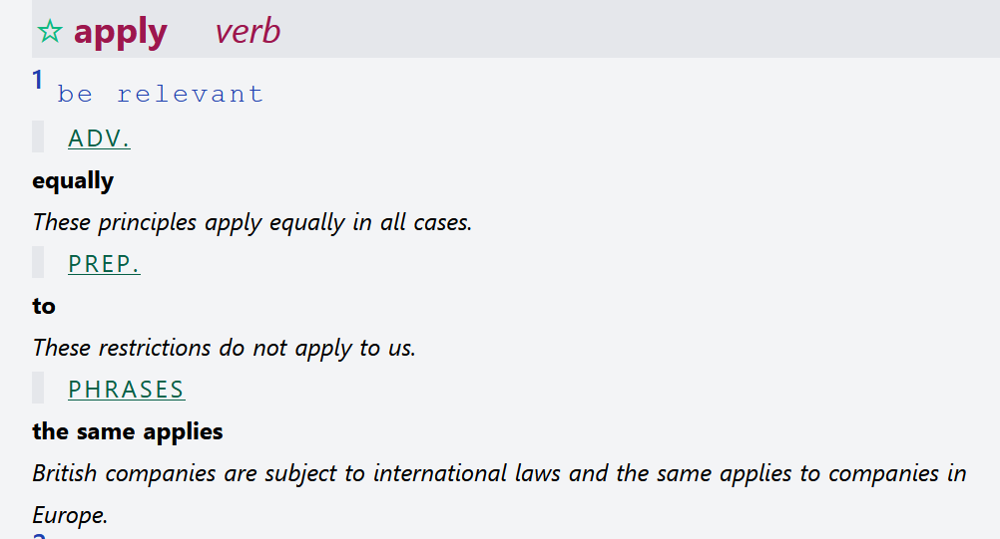
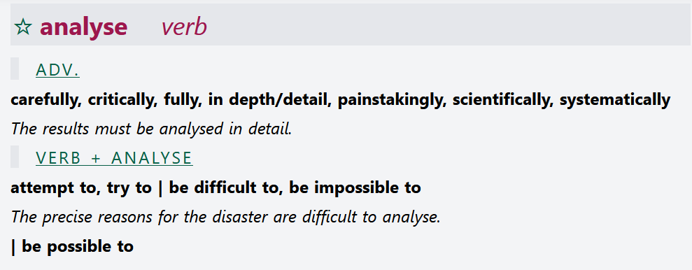

# OZDIC (Julia)

Note that the patterns are implicitly encoded by means of internal conventions:
the “Verb + analyse” tells us the order of the rdf container.

	  # head word
	  :apply-v a ontolex:LexicalEntry;
	  ontolex:sense :apply-v-sense1.

	  # this is collocation specific to a sense,
	  # this was forgotten before, but here, the sense is the observable (!)
	  :apply-v-sense1 skos:definition "be relevant".

we have no robust way to model syntactic patterns as a structural unit,
but the information is not lost, but transferred to the modifiers

(1) apply equally:

	  :apply-equally a frac:Collocation, rdfs:Seq;
	  rdf:_1 :apply-v-sense1;
	  rdf:_2 :equally-adv;
	  frac:attestation [ frac:quotation "These principles apply equally in all cases." ];
	  frac:head :apply-v-sense1.

	  # modifier
	  :equally-adv a ontolex:LexicalEntry;
	  lexinfo:partOfSpeech lexinfo:adverb. # syntactic pattern!

(2) apply to:

	  :apply-to a frac:Collocation, rdfs:Seq;
	  rdf:_1 :apply-v-sense1;
	  rdf:_2 :to-prep;
	  frac:attestation [ frac:quotation "These restrictions do not apply to us." ];
	  frac:head :apply-v-sense1.

	  :to-prep a ontolex:LexicalEntry;
	  lexinfo:partOfSpeech lexinfo:preposition. # syntactic pattern!

Not clear what to do with the "phrases" pattern of the dictionary.
Assuming that this only means that more than two words are involved, this is sufficiently
represented (implicitly) by the number of rdfs:members.

(3) the same applies:

	  :the-same-applies a frac:Collocation, rdfs:Seq;
	  rdf:_1 :the;
	  rdf:_2 :same;
	  rdf:_3 :apply-v-sense1;
	  frac:attestation [ frac:quotation "British companies are subject to international laws and the same applies to companies in Europe."];
	  frac:head :apply-v-sense1.

	  :the a ontolex:LexicalEntry. # no POS given, so not the-det or the like
	  :same a ontolex:LexicalEntry. # -"-

In "the same applies", we loose the agreement information between the same and applies
(singular). These does not seem to be a "good" way to enforce this. However, we
can just put the form *and* the sense into the same slot of the seq.
Note that this is syntactically correct. If we recommend this as a general practice,
we must state that the interpretation is that we use this to capture the overlap.
However, this overlap is meant to be conceptually, not extensionally, because the form
and the sense are distinct.

	  :the-same-applies rdf:_3 :apply-v-applies.

	  :apply-v-applies ontolex:writtenRep "applies".
	  :apply-v ontolex:lexicalForm :apply-v-applies.

  note that we have no agreement information in the resource, so we only provide the string.

Same situation as in the previous example BUT here we have two differentiated
sets (attempt to, try to) and (be difficult to, be impossible to). Do we want
to somehow “keep” those two sets differentiated?

> CC: I don't see how we could and I am not sure whether we should. Effectively, these are  different grammatical constructions, and putting "be difficult" under "VERB" is a bit of a stretch. I would consider this to be an aspect of representation and to be solved with lexicog:subComponentOf (and then, we need to create one lexicog:Components for each "block" in the layout)

	  :analyse-verb a ontolex:LexicalEntry.
	  # no sense differentiation here

	  :analyze-carefully a frac:Collocation, rdfs:Seq;
	  rdf:_1 :analyse-verb;
	  rdf:_2 :carefully-adv.

	  :analyse-in-depth a frac:Collocation, rdfs:Seq;
	  rdf:_1 :analyse-verb;
	  rdf:_2 :in-depth-adv. # sic! encoded as such in the original

	  :analyse-in-detail a frac:Collocation, rdfs:Seq;
	  rdf:_1 :analyse-verb;
	  rdf:_2 :in-detail-adv;
	  frac:attestation [ frac:quotation "The results must be analysed in detail."].

Notes:
- minor issues with grouping (suggestion: create one lexicog:Component for each group and associate it with the respective collocation, observable, etc.)
- syntactic patterns are not directly preserved, but their information is transferred into properties of the collocates
- we can capture form-function correlations between form and sense by putting multiple elements into the same slot in a collocation. The intended interpretation is that these must functionally overlap, but the formal interpretation is just a logical or (because they refer to distinct entities).
